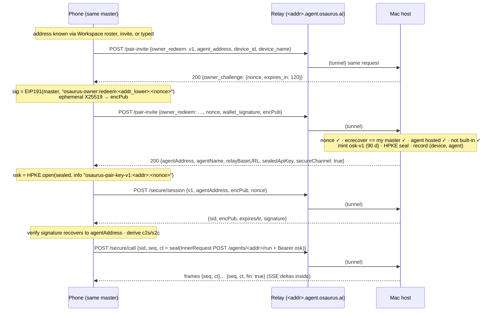
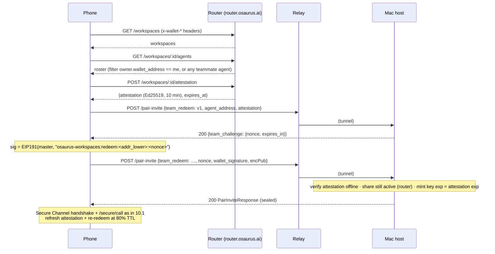
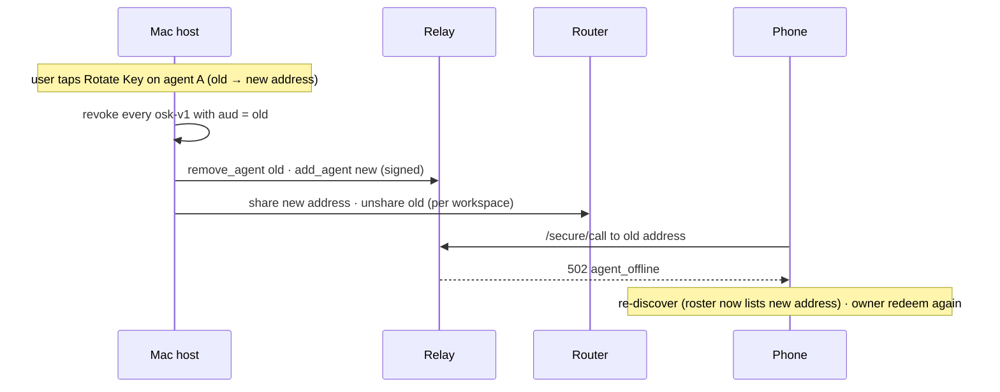

# Osaurus Mobile Protocol

Everything a second Osaurus client — an iPhone/iPad app, a second Mac, or any
same-identity device that does **not** host agents — needs in order to find,
authenticate to, and chat with the agents a user hosts on their Mac(s).

This document is the wire contract. Every shape below is lifted from the
shipping Swift implementation (file references are given per section) so a
client written against it interoperates with today's hosts without a router
or relay change. Normative language: **MUST** / **SHOULD** / **MAY**.

Related: [`IDENTITY.md`](IDENTITY.md) (identity model, key derivation),
[`SECURE_CHANNEL.md`](SECURE_CHANNEL.md) (E2E channel internals),
[`OSAURUS_WORKSPACES.md`](OSAURUS_WORKSPACES.md) (workspace sharing).

---

## Table of contents

1. [Scope and roles](#1-scope-and-roles)
2. [Identity bootstrap](#2-identity-bootstrap)
3. [Agent addressing](#3-agent-addressing)
4. [Discovery](#4-discovery)
5. [Getting an access key](#5-getting-an-access-key)
6. [Talking to the agent](#6-talking-to-the-agent)
7. [Presence, errors, and key lifecycle](#7-presence-errors-and-key-lifecycle)
8. [Crypto inventory for iOS](#8-crypto-inventory-for-ios)
9. [Compatibility contract](#9-compatibility-contract)
10. [Sequence diagrams](#10-sequence-diagrams)
11. [Osaurus Connect pairing (6-digit code)](#11-osaurus-connect-pairing-6-digit-code)
12. [Choosing a model](#12-choosing-a-model)
13. [Agent avatars](#13-agent-avatars)
14. [Reading the Mac's chats](#14-reading-the-macs-chats)

---

## 1. Scope and roles

| Role | Who | Holds | Does |
|---|---|---|---|
| **Host** | Osaurus for Mac | master key, agents, agent child keys, HTTP server, relay tunnel | Serves `/agents/{address}/run` for its agents through the relay; mints `osk-v1` keys |
| **Client** | Osaurus for iOS / second Mac | the **same** master key (or a key it obtained), device ID | Discovers hosted agents, obtains keys, chats over the Secure Channel |

Rules that follow from the current host implementation:

- A client **never opens a relay tunnel**. The relay maps each agent address to exactly one tunnel; only the device that hosts the agent authenticates it. A client that did so would evict the real host (`agent_removed reason:"superseded"`, [`RelayTunnelManager.swift`](../Packages/OsaurusCore/Networking/RelayTunnelManager.swift)).
- The **built-in Default agent is not reachable remotely** from any device, including the owner's own. `Agent.rejectBuiltInForExternalSurface` fires on every external surface ([`BuiltInAgentGuard.swift`](../Packages/OsaurusCore/Models/Agent/BuiltInAgentGuard.swift)); owner redeem returns `403` for it (§5.1). Only custom agents are addressable.
- "Same identity" means the client can produce EIP-191 signatures with the **master** secp256k1 key whose address equals the host's master address. That is the entire trust root for owner access; there is no account, session, or server-side registry of devices.
- Two Macs sharing an identity are just two hosts. Each mints device-scoped addresses (§3), so their agents never collide at the relay.

---

## 2. Identity bootstrap

The client must end up with the 32-byte master seed and a stable device ID.

### 2.1 Master key via iCloud Keychain (**BLOCKED** — not available to a phone today)

The host stores the master as a synchronizable generic-password item
([`MasterKey.swift`](../Packages/OsaurusCore/Identity/MasterKey.swift)):

| Attribute | Value |
|---|---|
| `kSecClass` | `kSecClassGenericPassword` |
| `kSecAttrService` | `com.osaurus.account` |
| `kSecAttrAccount` | `master-key` |
| `kSecAttrSynchronizable` | `true` (falls back to device-only if iCloud Keychain is off) |
| `kSecAttrAccessible` | `kSecAttrAccessibleWhenUnlocked` |
| `kSecAttrAccessGroup` | the Mac app's **default** per-app group today; `<TeamID>.ai.osaurus.identity` once the shared group ships (see below) |
| `kSecValueData` | 32 raw bytes (secp256k1 private scalar) |

The 24-word phrase lives beside it under `kSecAttrAccount = master-mnemonic`
([`MasterMnemonicStore.swift`](../Packages/OsaurusCore/Identity/MasterMnemonicStore.swift)),
UTF-8, space-separated.

**Why a phone cannot read it yet.** iCloud Keychain only delivers a synced
item to another app if both apps are in the same keychain access group, and
the Mac app currently writes only into its own default group, which a
different bundle ID can never join. The shared group
`<TeamID>.ai.osaurus.identity` is fully implemented behind
[`OsaurusKeychainGroup.swift`](../Packages/OsaurusCore/Identity/OsaurusKeychainGroup.swift)
but **is not enabled in the shipped Mac app**: `keychain-access-groups` is a
profile-managed entitlement on macOS, the Developer ID build carries no
provisioning profile, and adding the key made AMFI refuse to launch 0.19.3
(#1288 / #1296; a source test and the release spawn gate now keep it out).
Until the release pipeline embeds a profile (or another sharing mechanism is
chosen), **§ 2.2 (the phrase) is the only bootstrap path for a client on a
different bundle ID**, and an iOS client **MUST NOT** assume the master is
present in the Keychain.

**Contract once the group is enabled** (so the iOS side can be built now):

- The Mac writes every new item **twice** — its default per-app group (the
  only group a Mac on an older build can read) and the shared group
  (`MasterKey.addGenericPassword`). Items written by older builds gain a
  shared-group copy on the Mac's first successful read
  (`MasterKey.mirrorGenericPassword`); the original is never deleted, so a
  mixed-version fleet stays on one master.
- An iOS client **MUST** declare the same group and query with
  `kSecAttrSynchronizable = kSecAttrSynchronizableAny`.
- An iOS client that *creates* the identity **MUST** write into the shared
  group (its own default group is invisible to the Mac); the Mac mirrors that
  item into its default group on first read so older Mac builds can still
  unlock it.
- Until at least one Mac on an entitled build has read the item, a master
  written by an older Mac build is **not visible** on the phone — fall back to
  the phrase.

### 2.2 Master key via recovery phrase (fallback)

24 BIP39 English words. **Encoding is BIP39 entropy, not the PBKDF2 seed**:
the 32 bytes of entropy *are* the master scalar
([`MasterKeyMnemonic.swift`](../Packages/OsaurusCore/Identity/MasterKeyMnemonic.swift)):

```
words   = BIP39.encode(entropy = master[0..32], checksum = SHA256(master)[0] high 8 bits)
master  = BIP39.decodeEntropy(words)      // 24 words → 264 bits → 256 entropy + 8 checksum
```

Do **not** run the phrase through `PBKDF2-HMAC-SHA512("mnemonic"+passphrase)`;
that produces a different key and a different address.

### 2.3 Master address

EIP-55 checksummed Ethereum-style address of the secp256k1 public key
(`deriveOsaurusId`, [`CryptoHelpers.swift`](../Packages/OsaurusCore/Identity/CryptoHelpers.swift)):

```
pub     = secp256k1_pubkey(master)             // 64 bytes, uncompressed without 0x04
address = EIP55( keccak256(pub)[12..32] )      // "0x" + 40 hex, mixed-case checksum
```

Comparisons everywhere in the protocol are case-insensitive (`lowercased()`).

### 2.4 Device ID

Each device has an ID used for (a) scoping agent addresses minted *on that
device* and (b) labelling keys it redeems. Format: **8 lowercase hex chars**,
`SHA256(keyId)[0..4]` of an App Attest key on hardware that supports it, or of
a random software key otherwise ([`DeviceKey.swift`](../Packages/OsaurusCore/Identity/DeviceKey.swift)).
Semantics:

- `DeviceKey.ensureAttested()` returns the existing ID and only attests a new
  key when none exists; a master that arrived via iCloud sync therefore gets a
  device ID on first launch without touching the master.
- The ID is stored in `UserDefaults`; a defaults reset regenerates it. That is
  harmless for chat (a client's device ID only labels its keys) and harmless
  for hosted v2 agents (their scope is persisted on the agent record).
- Clients **MAY** use any stable opaque token ≤ 64 chars of `[A-Za-z0-9._-]`
  as `device_id` in owner redeem (§5.1); Osaurus clients use the 8-hex ID.

---

## 3. Agent addressing

Every hosted agent has a secp256k1 **child key** derived from the master, and
its address is the agent's identity on the wire. Two layouts exist
([`AgentKey.swift`](../Packages/OsaurusCore/Identity/AgentKey.swift)):

```
v1 (legacy, master-global):
  child = HMAC-SHA512(key = master, msg = "osaurus-agent-v1" || BE32(index))[0..32]

v2 (device-scoped):
  child = HMAC-SHA512(key = master,
                      msg = "osaurus-agent-v2" || utf8(deviceScope) || 0x00 || BE32(index))[0..32]

address = EIP55(keccak256(pubkey(child))[12..32])
```

`AgentKeyPath { index: UInt32, deviceScope: String? }` names a derivation;
`deviceScope == nil ⇒ v1`. New agents are minted v2 under the hosting device's
ID; agents that predate device scoping stay v1 until the user rotates them.

What this means for a client:

- **No wire format carries an index or scope.** `osk-v1` (`iss`/`aud`),
  invites (`addr`), workspace rosters, relay auth frames, Secure Channel hellos
  all pin an *address + signature*. A client never needs to re-derive an
  agent key to chat; it only needs the address.
- Given `(master, scope, index)` a same-identity client *can* recompute any of
  its agents' child keys. Today nothing requires it. Do not build features on
  it without also persisting `(scope, index)` somewhere the client can read.
- Two hosts sharing a master never collide on v2 addresses because scopes
  differ. Collisions only arise from duplicated agent *state* (restored
  backup running on two Macs, bundle import while the source still runs);
  the relay resolves them by "last authenticated tunnel wins" (§7.3).

---

## 4. Discovery

"Which agents does my identity host, and where?" There are two shipped
surfaces and one proposed.

### 4.1 Workspaces roster (shipped)

If the user has shared agents into any Workspace, the router lists them.
All `/workspaces/*` calls are signed with the master key
([`OsaurusRouterAuthSigner.swift`](../Packages/OsaurusCore/Services/Router/OsaurusRouterAuthSigner.swift)):

```
Headers:
  x-wallet-address:   <master address, lowercase>
  x-wallet-timestamp: <unix seconds>
  x-wallet-signature: 0x<65-byte EIP-191 signature, hex>
  x-wallet-nonce:     <optional, only when the route demands one>

Message (EIP-191 personal_sign):
  "osaurus-credits:<address_lower>:<METHOD>:<pathAndQuery>:<timestamp>:<sha256hex(body)>:<nonce or empty>"
```

Base URL `https://router.osaurus.ai`. Relevant routes:

| Route | Returns |
|---|---|
| `GET /workspaces` | `{"data":[{id, name, role, source?, active?, members_active?, agents_shared?, created_at?}]}` |
| `GET /workspaces/:id/agents` | `{"data":[{agent_address, display_name?, description?, owner:{account_id, wallet_address, display_name}, relay_url?, online?, last_seen?, shared_at?}]}` |

A client filters the roster by `owner.wallet_address == myMasterAddress`
(case-insensitive) to find its own agents. The host-side flags this maps to
are documented in [`OSAURUS_WORKSPACES.md`](OSAURUS_WORKSPACES.md) ("Owned vs.
hosted"): the client is `isOwnedByMe && !isHostedHere`.

### 4.2 Agent invite deep link / QR (shipped)

The host can issue a per-agent invite ([`AgentInvite.swift`](../Packages/OsaurusCore/Models/Agent/AgentInvite.swift)):

```
osaurus://<addr>?pair=<base64url(json)>

json = {"v":1,"addr":"0x…","name":"Writer","desc":"…"|null,
        "url":"https://<addr_lower>.agent.osaurus.ai","nonce":"<base64url 32B>",
        "exp":<unix s>,"sig":"<hex 65B>"}

signed bytes: "osaurus-agent-invite-v1:<addr>:<nonce>:<exp>"
domain:       "Osaurus Signed Invite"   → recovered signer MUST equal addr
```

The client posts the **exact** JSON back to `POST <url>/pair-invite`
(optionally adding `"encPub"`), receives a `PairInviteResponse` (§5.4).
Single-use, host-enforced expiry.

### 4.3 Proposed — not implemented

Neither the router nor the host exposes "all agents hosted under this master"
today. Two candidate designs, recorded so the client and router converge:

1. **Router `GET /me/agents`** (wallet-signed): every agent address the
   wallet has *ever* authenticated at the relay, with `host_device` (the
   hosting device's ID, sent by the host as an additive field on
   `add_agent`), `online`, `last_seen`. Requires a relay/router change.
2. **iCloud key-value directory**: each host writes
   `hosted-agents/<deviceId>.json = [{address, name, scope, index, updatedAt}]`
   to `NSUbiquitousKeyValueStore`; a client merges all entries. No server
   change, but eventual-consistency and 1 MB KVS limits apply.

Until one ships, a client **MUST** rely on §4.1 / §4.2 or on the user typing
an agent address obtained from the Mac's Identity view.

---

## 5. Getting an access key

Every remote request carries an agent-scoped `osk-v1` bearer. Three ways to
obtain one; a same-identity client uses **owner redeem** first.

All three run on the same public host route through the relay:

```
POST https://<agent_address_lower>.agent.osaurus.ai/pair-invite
Content-Type: application/json
```

The route is rate-limited per source IP; a `401`/`403` penalises the source.
Sensitive fields are redacted from the host's request log.

### 5.1 Owner redeem (same identity, primary)

Host: [`OwnerDeviceAccessHost.swift`](../Packages/OsaurusCore/Services/Auth/OwnerDeviceAccessHost.swift),
route branch in `HTTPHandler.handlePairInviteEndpoint`.

**Step 1 — request a challenge**

```json
{"owner_redeem": {"v": 1,
                  "agent_address": "0xAbC…",
                  "device_id": "c3d4e5f6",
                  "device_name": "iPhone"}}
```

→ `200`

```json
{"owner_challenge": {"nonce": "<base64url 32B>", "expires_in": 120}}
```

The host issues a challenge without revealing whether the agent exists.
Validation at this step: `v == 1`; `agent_address` is `0x` + 40 hex;
`device_id` is 1–64 chars of `[A-Za-z0-9._-]`; `device_name` ≤ 80 chars
(optional). Anything else → `400`.

The pending table is bounded: **one outstanding challenge per
`(agent_address, device_id)`** — asking again replaces (invalidates) the
earlier nonce for that pair — plus a hard cap on the whole table
(`maxPendingChallenges`, oldest-expiring evicted first) and the 120 s TTL.
Clients **MUST** use the most recent nonce they were issued.

**Step 2 — prove the master, receive the key**

```
message   = "osaurus-owner:redeem:<agent_address_lower>:<nonce>"
signature = EIP191_sign(master, message)        // 65 bytes r‖s‖v (v = 27/28)
```

```json
{"owner_redeem": {"v": 1,
                  "agent_address": "0xAbC…",
                  "device_id": "c3d4e5f6",
                  "device_name": "iPhone",
                  "nonce": "<from step 1>",
                  "wallet_signature": "0x<130 hex>",
                  "encPub": "<base64url X25519 public key>"}}
```

`encPub` is **required**: the base64url of a 32-byte raw X25519 public key
generated fresh for this exchange. Every Osaurus client can mint one, and
the relay terminates TLS and is untrusted by design, so a 90-day agent key
is never returned in plaintext.

Host checks, in order:

| # | Check | Failure |
|---|---|---|
| 0 | `encPub` present and parses as a raw X25519 public key — checked **before** the nonce is consumed, so a malformed attempt does not burn it | `400 encPub is required: a base64url X25519 public key (32 bytes)` |
| 1 | nonce known, unexpired (120 s), issued for this `agent_address` **and** `device_id`; consumed on use | `401 Unknown or expired challenge nonce` |
| 2 | host can read its master non-interactively | `503 Host identity is unavailable right now` |
| 3 | `ecrecover(message, wallet_signature) == host master address` | `401 Signature does not match this host's identity` |
| 4 | an agent with that address is hosted here | `404 Agent address not found on this server` |
| 5 | agent is not built-in | `403 Built-in agents are not reachable from other devices` |
| 6 | mint `osk-v1` (label `Owner device – <device_name>`, 90-day expiry, `aud` = agent address) | `500 Failed to mint access key` |
| 7 | HPKE-seal the key to `encPub` (§5.4); if sealing fails the minted key is deleted and nothing is returned | `500 Failed to mint access key` |

→ `200 PairInviteResponse` (§5.4) with `"secureChannel": true` and the key
only inside `sealedApiKey`; `apiKey` is always empty on this path.

Semantics:

- **One live key per `(device_id, agent)`.** Re-running the redeem replaces
  (deletes) the previous key for that pair. Clients **SHOULD** re-redeem
  before expiry rather than hoard keys.
- The host records `{keyId, deviceId, deviceName, agentAddressLower, issuedAt}`
  in `~/.osaurus/identity/owner-devices.json` so the user can revoke one
  device's keys from the Mac. Rotating the agent's key revokes them all.
- Signatures over the workspace wording (`osaurus-workspaces:redeem:…`) are
  **not** accepted here and vice versa — the domain string is part of the
  proof.
- There is no plaintext delivery. Unlike the invite and workspace flows,
  where `encPub` is optional for older connectors, owner redeem has no
  legacy clients to accommodate and refuses step two without a usable key.

### 5.2 Workspace redeem (teammate or same identity via a Workspace)

Host: [`WorkspaceAgentAccessHost.swift`](../Packages/OsaurusCore/Services/Router/WorkspaceAgentAccessHost.swift).
Requires a router membership attestation:

```
POST https://router.osaurus.ai/workspaces/:id/attestation   (wallet-signed headers, §4.1)
→ {"attestation": "<base64url(payload)>.<base64url(ed25519 sig)>", "expires_at": "…"}

payload = {"v":1,"workspace_id":"…","account_id":"…","wallet":"0x… lowercase",
           "role":"owner|admin|member|viewer","iat":<s>,"exp":<s>}     // TTL 10 min
router key: GET /workspaces/attestation-key → {"alg":"Ed25519","public_key":"<base64url 32B>"}
```

Step 1:

```json
{"team_redeem": {"v": 1, "agent_address": "0x…", "attestation": "<token>"}}
```

→ `{"team_challenge": {"nonce": "…", "expires_in": 120}}`

Step 2 adds `"nonce"`, `"wallet_signature"` (EIP-191 by the **master** over
`osaurus-workspaces:redeem:<agent_address_lower>:<nonce>`; the legacy wording
`osaurus-teams:redeem:…` is still accepted by hosts), `"encPub"`. Host
verifies the attestation offline, re-checks the share with the router, and
mints a key whose `exp` **equals the attestation's** `exp`. Clients refresh at
80 % of TTL (`WorkspaceAgentAccess.refreshFraction`).

A same-identity client **MAY** use this path when the agent is shared into a
Workspace; nothing in the handshake rejects the host's own wallet.

### 5.3 Invite redeem

Post the invite JSON (§4.2) plus optional `"encPub"`. Host verifies `sig`,
consumes `nonce`, mints a 1-year key labelled `Invite – <name> (<nonce8>)`.

### 5.4 The response and the HPKE envelope

All three redeems return the same body:

```json
{"agentAddress": "0xAbC…",
 "agentName": "Writer",
 "agentDescription": "…" | null,
 "agentModel": "…" | null,
 "relayBaseURL": "https://0xabc….agent.osaurus.ai",
 "apiKey": "" ,
 "sealedApiKey": {"enc": "<base64url>", "ct": "<base64url>"} | null,
 "secureChannel": true}
```

`apiKey` is empty when `sealedApiKey` is present. Open the envelope
([`PairingKeyEnvelope.swift`](../Packages/OsaurusCore/Identity/PairingKeyEnvelope.swift)):

```
suite = HPKE(KEM = DHKEM(X25519, HKDF-SHA256), KDF = HKDF-SHA256, AEAD = ChaCha20-Poly1305)
info  = utf8("osaurus-pair-key-v1:<agent_address_lower>:<nonce>")
key   = HPKE.Recipient(privateKey = my ephemeral X25519, info, encapsulatedKey = enc).open(ct)
```

`<nonce>` is the challenge nonce for owner/workspace redeem and the invite
nonce for invites. A client **MUST** generate a fresh X25519 key per exchange.

**`osk-v1` format** (what you received):

```
"osk-v1." + base64url(payload_json) + "." + hex(65-byte signature)
payload = {"aud":"<agent address>","cnt":<uint64>,"exp":<s>|null,"iat":<s>,
           "iss":"<agent address>","lbl":"<label>"|null,"nonce":"<base64url>"}
signed with domain "Osaurus Signed Access" by the agent child key (iss).
```

Clients treat it as an opaque bearer; they **MAY** read `exp` to schedule a
re-redeem.

---

## 6. Talking to the agent

### 6.1 Relay URL

`https://<agent_address_lower>.agent.osaurus.ai`. The relay forwards HTTP to
the tunnel that authenticated that address. No client auth at the relay.

### 6.2 Secure Channel v1 — mandatory

Remote requests to `/agents/{…}/run` and `/agents/{…}/dispatch` that arrive
in plaintext are refused with `426`:

```json
{"error":{"code":"secure_channel_required","message":"…","type":"upgrade_required"}}
```

Handshake ([`SecureChannel.swift`](../Packages/OsaurusCore/Identity/SecureChannel.swift)):

```
POST /secure/session
{"v":1,"agentAddress":"0x… lowercase","encPub":"<base64url X25519 pub>","nonce":"<base64url 16B>"}

→ {"v":1,"sid":"<base64url 16B>","encPub":"<base64url X25519 pub>","expiresAt":<unix s>,
   "signature":"0x<130 hex>"}

transcript = utf8("osaurus-sc1|v=1|aA=<agentAddress>|eC=<client encPub>|nC=<nonce>"
                  + "|sid=<sid>|eS=<server encPub>|exp=<expiresAt>")
ecrecover(transcript, signature, domain "Osaurus Secure Channel") MUST == agentAddress

shared = X25519(eC_priv, eS_pub)
salt   = SHA256(transcript)
c2s    = HKDF-SHA256(shared, salt, info = "osaurus-sc1:c2s", 32)
s2c    = HKDF-SHA256(shared, salt, info = "osaurus-sc1:s2c", 32)
```

Session TTL 1 h (`expiresAt`); re-handshake on `401 secure_session_unknown`.

Call framing:

```
POST /secure/call
{"v":1,"sid":"<sid>","seq":<uint64, monotonic per session>,"ct":"<base64url ct‖tag>"}

nonce(seq) = 0x00000000 ‖ BE64(seq)                      // 12 bytes
AAD(req)   = utf8("osaurus-sc1:req:<sid>:<seq>")
ct         = ChaCha20-Poly1305.seal(key = c2s, nonce(seq), AAD, plaintext = InnerRequest JSON)

InnerRequest = {"method":"POST","path":"/agents/<address>/run",
                "authorization":"Bearer osk-v1.…","accept":"text/event-stream",
                "contentType":"application/json","headers":{…}|null,
                "body":"<base64url(body bytes)>"}
```

Responses are frames `{"seq":<n>,"ct":"…","fin":true|absent}`:

```
respKey(reqSeq) = HKDF-SHA256(s2c, salt = <empty>, info = "osaurus-sc1:respkey:<reqSeq>", 32)
AAD(resp)       = utf8("osaurus-sc1:resp:<sid>:<reqSeq>:<seq>:<fin ? 1 : 0>")
```

- Buffered response: one frame, `fin: true`, plaintext
  `{"status":<int>,"contentType":"…","body":"<base64url>"}`.
- SSE stream: frames `seq = 0,1,2,…` each decrypting to raw SSE bytes; the
  last has `fin: true`. A stream that ends without an authenticated `fin`
  **MUST** be treated as truncated.
- `409 secure_replay`: never resend an envelope with the same `seq`.

### 6.3 The inner run request

`POST /agents/<agent_address>/run` — a `ChatCompletionRequest` body; `model`
**MAY** be omitted (host uses the agent's effective model):

```json
{"messages":[{"role":"user","content":"hello"}],
 "stream": true,
 "session_id": "<client-stable conversation id>",
 "workspace_context": {"workspace_id":"…","agent_address":"0x…"}}
```

- `session_id` (optional) scopes host-side conversation/cache state to one
  client conversation.
- `workspace_context` (optional) is only for workspace-billed runs with a
  workspace-minted key; omit it for owner-redeemed keys.
- Response is standard OpenAI-style SSE `data: {…}` chunks with text and
  `reasoning_content` deltas. Tool calls execute on the host; their
  arguments and results are never forwarded, but progress is, as
  extension chunks with empty `choices`: `osaurus_agent_tool`
  (`{phase: "started"|"completed", name, call_id, is_error?, end_run?}`),
  `osaurus_prefill` (`{stage, completedUnitCount, totalUnitCount}`) and
  `osaurus_artifacts`. Ends with `data: [DONE]`.
- Callers that own the Mac (loopback, or a master-scoped key such as the
  Osaurus Connect phone, §11) also get, on `osaurus_agent_tool`: `label`
  (the Mac UI's own running / done / failed text), `category`
  (`file|search|terminal|network|database|code|general`), `icon` (SF
  Symbol), `arguments` on "started" (secret-scrubbed JSON, ≤ 8 000 chars),
  and `result` (≤ 16 000 chars, `result_truncated: true` when cut) plus
  `duration_ms` on "completed". Agent-scoped and workspace-minted callers
  never receive these fields.

`GET /agents/<address>` (inside the channel, same bearer) returns agent
metadata for the roster.

---

## 7. Presence, errors, and key lifecycle

### 7.1 Relay errors (outer HTTP, before the host answers)

| Status | Body | Meaning | Client action |
|---|---|---|---|
| `502` | `{"error":"agent_offline"}` | No tunnel for this address | Show offline; retry later |
| `502` | `{"error":"tunnel_send_failed"}` | Tunnel dropped mid-request | Retry once after backoff |
| `504` | `{"error":"gateway_timeout"}` | Host did not answer | Retry; long runs should stream |

### 7.2 Presence

The relay keeps an address "online" for `AGENT_TTL_SECONDS = 20` after the
last tunnel heartbeat; a host that dies can read as online for up to 20 s.
Workspace rosters expose `online` / `last_seen` from that state; a `502
agent_offline` from a real request is fresher than a roster `online: true`.

### 7.3 `superseded`

If two tunnels authenticate the same address, the newer wins and the older
receives `agent_removed reason:"superseded"` and stops reconnecting. For a
**client** this is invisible except that the agent may briefly flap; requests
simply reach whichever device holds the address now. A client **MUST NOT**
attempt to "take over" an address.

### 7.4 Key expiry, replacement, revocation

| Key source | Lifetime | Renewal | Revocation |
|---|---|---|---|
| Owner redeem | 90 d | Re-redeem (replaces the old key for that device+agent) | Mac Identity view (per key / per device); agent key rotation |
| Workspace redeem | = attestation `exp` (≤ 10 min) | Refresh at 80 % TTL with a new attestation | Unshare, member removal, workspace deletion, rotation |
| Invite | 1 y | New invite | Mac issued-invites list; rotation |

A revoked or expired key fails **inside** the channel with the inner status
`401`. Agent key **rotation** on the Mac revokes every key whose `aud` was
the old address; the agent gets a new address and every client must
re-discover and re-redeem (the host re-authenticates the relay and migrates
workspace shares automatically).

### 7.5 Host-side error bodies for owner redeem

`{"error":"<message>"}` with the statuses in §5.1. Messages are stable
strings; match on status, not text.

---

## 8. Crypto inventory for iOS

| Need | Primitive | Where used | Suggested API |
|---|---|---|---|
| Master / agent keys | secp256k1 recoverable ECDSA, Keccak-256 | addresses, EIP-191, `osk-v1`, invites, Secure Channel signature | `swift-secp256k1` (`P256K.Recovery`) |
| Child derivation | HMAC-SHA512 | §3 | CryptoKit `HMAC<SHA512>` |
| Mnemonic | BIP39 (entropy encoding) | §2.2 | any BIP39 wordlist impl; **skip PBKDF2** |
| Key delivery | HPKE X25519 / HKDF-SHA256 / ChaCha20-Poly1305 | §5.4 | CryptoKit `HPKE` (iOS 17+) |
| Channel | X25519, HKDF-SHA256, ChaCha20-Poly1305, SHA-256 | §6.2 | CryptoKit |
| Attestation verify | Ed25519 | §5.2 | CryptoKit `Curve25519.Signing` |
| Device ID | App Attest / SHA-256 | §2.4 | `DCAppAttestService` |
| Keychain | shared access group, `kSecAttrSynchronizable` (**blocked** until the Mac build ships the group; use §2.2) | §2.1 | Security.framework |

**Signature domain prefixes.** Every secp256k1 signature is over
`"\x19" + prefix + ":\n" + len(payload) + payload` (EIP-191 layout) and the
prefixes are never interchangeable:

| Prefix | Signed by | Used for |
|---|---|---|
| `Ethereum Signed Message` | master | router headers, owner/workspace redeem proofs, relay `add_agent` |
| `Osaurus Signed Access` | agent child | `osk-v1` |
| `Osaurus Signed Invite` | agent child | `AgentInvite.sig` |
| `Osaurus Secure Channel` | agent child | `ServerHello.signature` |
| `Osaurus Signed Pairing` / `… Pairing Server` | connector / agent child | LAN `/pair` (not used by a relay-only client) |
| `Osaurus Signed Message` | master | `TokenPayload` internal tokens (not used on the wire by a client) |

Recovery: `v ∈ {27, 28}` appended as the 65th byte; hex is lowercase; the
`0x` prefix is present on JSON fields (`wallet_signature`, `signature`, `sig`).

---

## 9. Compatibility contract

- **Additive only.** Hosts add JSON fields; they never rename or remove one
  within a version. Unknown fields **MUST** be ignored by both sides.
- **Version fields.** `owner_redeem.v`, `team_redeem.v`, `AgentInvite.v`,
  `ClientHello.v`, attestation `v`: all `1`. A host rejects an unknown version
  with `400`; a client must not send a version it does not implement.
- **Legacy wordings hosts still accept.** `osaurus-teams:redeem:…` (workspace
  redeem signature), `team_id` (in `workspace_context` and attestation
  payloads). New clients send only the current wording.
- **Addresses.** v1 and v2 agents are indistinguishable on the wire and both
  fully supported by every flow above. A client **MUST NOT** infer layout
  from an address.
- **Downgrade behaviour.** A client that lacks the Secure Channel cannot run
  agents (`426`); there is no plaintext fallback. A host older than owner
  redeem answers the `owner_redeem` envelope with `400 Invalid invite payload`
  (it falls through to the invite decoder) — clients **SHOULD** map that to
  "update Osaurus on the Mac".
- **Host data written by older builds.** A host downgraded and re-upgraded
  may have lost `agentDeviceScope` on v2 agents; the host repairs this itself
  on the next Identity view load (`IdentityDrift.recoverableScopeAgents`).
  Addresses are unchanged throughout, so clients are unaffected.
- **Future v3 addressing** must add an explicit key-version field to the agent
  record rather than overloading `deviceScope`; wire formats stay address-only.

---

## 10. Sequence diagrams

### 10.1 Owner redeem, then chat



### 10.2 Workspace redeem, then chat



### 10.3 Address rotation seen from a client



---

## 11. Osaurus Connect pairing (6-digit code)

The iOSaurus app pairs with **one** Mac by typing a 6-digit code shown in
Settings → Osaurus Connect. It needs no master key on the phone and yields a
master-scoped `osk-v1` key covering every agent on that Mac, plus each agent's
crypto address for the Secure Channel (§6.2). One phone per Mac: a new
pairing revokes the previous phone's key.

### 11.1 Discovery

While the server is exposed to the network the Mac advertises itself (not an
agent) as `_osaurus-mobile._tcp` with TXT `name=<computer name>`, `v=1`. The
phone may also accept a manually entered host and port.

### 11.2 Generating the code (Mac)

"Generate Pairing Code" mints the master-scoped key immediately (biometric
prompt — the user is at the Mac) and shows a uniformly random 6-digit code.
The code is single-use, valid for 5 minutes, and discarded after 5 wrong
guesses from any source; an unused code's key is deleted.

### 11.3 Redeeming (phone)

```
POST /pair/code            (unauthenticated, LAN only, rate-limited per IP)
{"v":1,"code":"123456","deviceId":"<stable per-install id>",
 "deviceName":"My iPhone","encPub":"<base64url X25519 pub>",
 "isSimulator":true}   // optional; omit on real devices

→ 200 {"v":1,"sealed":{"enc":"<base64url>","ct":"<base64url>"}}

sealed = HPKE(X25519, HKDF-SHA256, ChaCha20-Poly1305) to encPub,
         info = utf8("osaurus-connect-pair-v1:<deviceId>")
plaintext = {"apiKey":"osk-v1.…","keyExpiresAt":<unix s>|null,
             "hostName":"…","agents":[{"id":"<uuid>","name":"…","address":"0x…",
                         "relayURL":"https://0x….agent.osaurus.ai"|null}]}
```

| Status | Body `error` | Meaning |
|---|---|---|
| `400` | `bad_request` | Malformed body, unsupported `v`, missing device fields, bad `encPub` (code not consumed) |
| `401` | `invalid_code` | Wrong, expired, locked out, or no active code — deliberately indistinguishable |
| `403` | `lan_only` | Arrived through the relay |
| `429` | — | Per-IP rate limit (shared with `/pair`) |

`isSimulator` (optional) only drives a "Simulator" badge next to the paired
device in Settings → Osaurus Connect.

The phone pins every returned `address` against its agent `id` and uses the
key as the Bearer inside the Secure Channel. `GET /agents` and
`GET /agents/{id}` include additive `address` and `relay_url` fields so agents created after
pairing can be learned; fetch the roster **inside** the Secure Channel of an
already-pinned agent so the new addresses are authenticated.

### 11.4 Lifecycle

- Keys last 90 days; re-pair to renew. Unpair on the Mac revokes the key
  immediately (inner `401` for the phone, which should return to pairing).
- The phone unpairs itself with `POST /pair/unpair` (no body, inside the
  Secure Channel with its Bearer): `200 {"ok":true}` revokes its key and
  clears the Mac's "Paired iPhone"; `403 not_paired_device` for any other
  key. If the Mac is unreachable the phone forgets the pairing anyway and
  the stale entry stays on the Mac until removed there.
- "Keep Mac Awake for Paired iPhone" (default on) holds an idle-system-sleep
  assertion while a phone is paired.

### 11.5 Security notes

The code travels in cleartext on the LAN. A passive observer learns a
single-use code that is useless after redemption, and the key itself is
sealed to the phone's ephemeral key. An **active** LAN attacker who
intercepts the code inside its 5-minute window can redeem it first; the Mac
then shows the attacker's device name under "Paired iPhone", and the real
phone's redemption fails. The residual risk is accepted for v1 (LAN-only,
short-lived, user-initiated); a PAKE (e.g. SPAKE2 over the code) would remove
it.

### 11.6 Reaching the Mac away from the LAN

"Reach From Anywhere" (Settings → Osaurus Connect, default on) turns on the
relay tunnel (§6.1) for every remote agent while a phone is paired, and off
again — only for tunnels it turned on — when disabled or unpaired. Agents
created later are added automatically.

- The pairing payload carries `relayURL` per agent, and `GET /agents`
  carries `relay_url` for agents whose tunnel is on (`null` = LAN only).
  Both equal `https://<address_lower>.agent.osaurus.ai`.
- The phone keeps both routes and sends the same Secure Channel envelopes
  (§6.2) to either base URL; nothing else changes. Prefer the LAN address
  when it answers `/health` quickly, otherwise use the relay URL.
- Relay failures surface as the outer errors in §7.1 (`502 agent_offline`
  when the Mac is asleep, offline, or the tunnel is off).
- `/pair/code` still refuses relay traffic (§11.3); pairing is LAN only.

---

## 12. Choosing a model

Owner-only (loopback or a master-scoped key such as the §11 phone; others
get `403 owner_only`). Send inside the Secure Channel like any other call.

### 12.1 `GET /models/picker`

The chat models the Mac composer's picker lists
(`ModelPickerItemCache.chatModelCandidates`):

```json
{"models":[{"id":"mlx-community/Qwen3-8B-4bit","name":"Qwen3 8B","provider":"Local",
            "source":"local","vision":false,"thinking":true,"params":"8B",
            "quantization":"4bit","available":true,"description":null}]}
```

`source` is `foundation | local | remote | claude-code`; `provider` is the
tab title (e.g. "Local" or the remote provider's name). `available: false`
marks rows the Mac greys out.

### 12.2 `PUT /agents/{id}/model`

`{"model":"<id from 12.1>"}` (or `null` to reset) sets the agent's default
model — exactly what picking a model in the Mac composer does — and returns
`{"ok":true,"effective_model":"…"}`. `404 agent_not_found` for unknown or
built-in agents. Per-chat choice is simply the `model` field of `/run`
(§6.3); shared workspace agents still refuse overrides
(`workspace_model_locked`).

---

## 13. Agent avatars

`GET /agents` and `GET /agents/{id}` carry the agent's mascot id in `avatar`
(`blue | green | orange | purple | red | yellow`; the client falls back to a
monogram of the agent's name) and `custom_avatar: true` when the user picked
their own image.

`GET /agents/{id}/avatar` returns those image bytes with the matching
`image/*` content type. Owner-only (`403 owner_only` otherwise), since the
image is host content; `404 no_custom_avatar` when the agent has none. The
mascot images themselves ship inside each client.

---

## 14. Reading the Mac's chats

Owner-only (§12), inside the Secure Channel. These expose the user's own
chat history from `~/.osaurus/chat-history/history.sqlite`.

### 14.1 `GET /sessions[?agent_id=…&archived=true&limit=200]`

Metadata only, newest first; archived chats are excluded unless asked for.

```json
{"sessions":[{"id":"<uuid>","title":"Bitcoin price","created_at":"…","updated_at":"…",
              "agent_id":"<uuid>|null","selected_model":"qwen3","source":"chat",
              "archived":false,"pinned":true}]}
```

`agent_id` is null for the built-in Default agent's chats. `source` is where
the chat came from (`chat`, `http`, `channel`, `schedule`, …).

### 14.2 `GET /sessions/{id}`

The same fields plus `turns`, in the Mac's block shape:

```json
{"turns":[{"id":"<uuid>","role":"assistant","content":"…","thinking":"…",
           "thinking_duration_ms":2500,
           "tool_calls":[{"call_id":"…","name":"web_search","arguments":"{…}",
                          "result":"…","duration_ms":1250}],
           "attachment_count":0,"created_at":"…","completed_at":"…","token_count":42}]}
```

Tool-result turns are folded into the assistant turn that called them, so a
client renders one timeline per turn. Attachments are counted, not inlined.
`404 session_not_found` for an unknown id.

### 14.3 `PATCH /sessions/{id}`

`{"title"?: "…", "archived"?: bool, "pinned"?: bool}` → `{"ok":true}`. Each
field is a targeted column update, so a rename can never drop the
transcript.

### 14.4 `GET /agents/{id}/tools`

```json
{"tools":[{"name":"web_search","description":"…","enabled":true,"policy":"auto",
           "remote_safe":true,"blocked_by":null}]}
```

`policy` is the effective permission (`auto | ask | deny`). `remote_safe` is
true only when running the tool raises no approval card on the Mac and the
surface allows it — an `ask` tool would block on a card the phone can't
answer yet (that arrives with remote approvals). `blocked_by` lists
ungranted requirements or missing system permissions.
