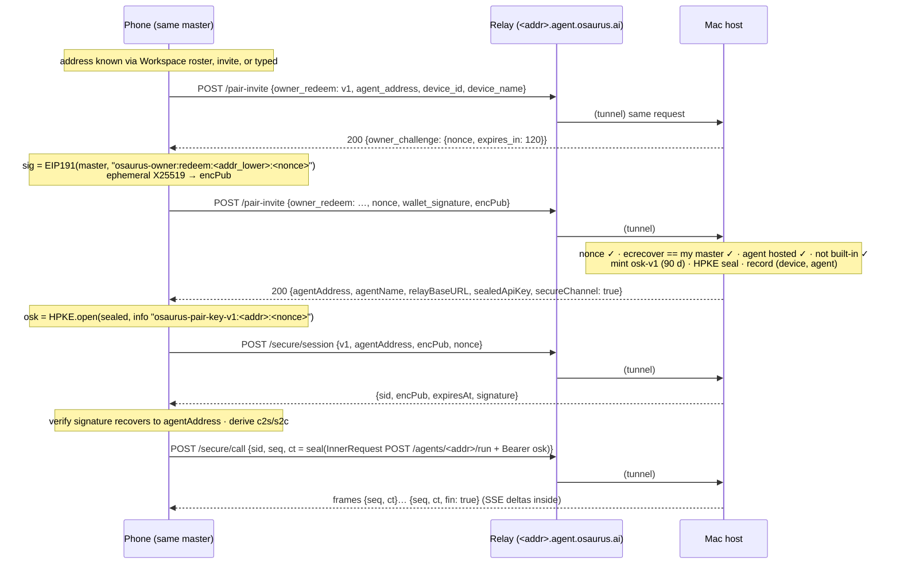
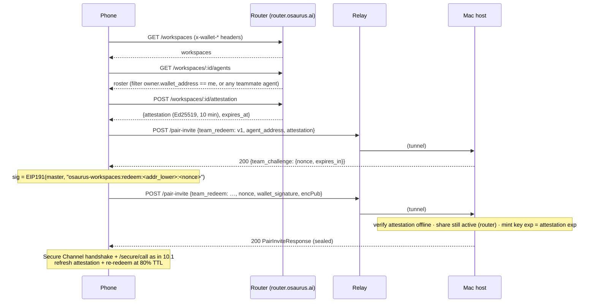
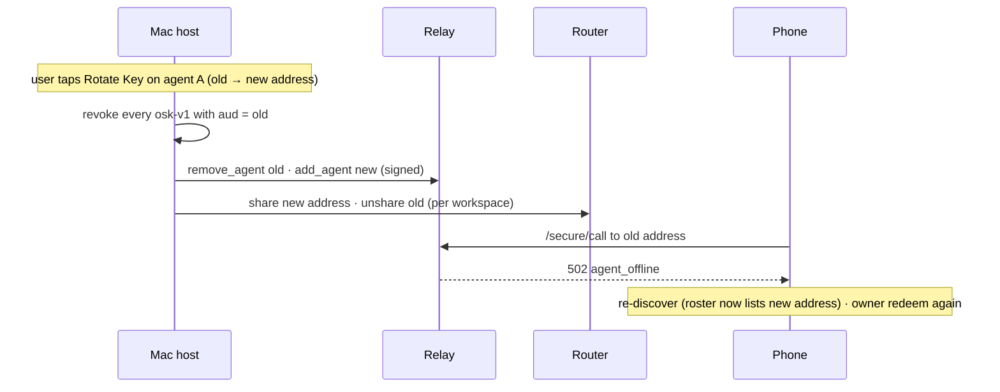

# Osaurus Mobile Protocol

Everything a second Osaurus client — an iPhone/iPad app, a second Mac, or any
same-identity device that does **not** host agents — needs in order to find,
authenticate to, and chat with the agents a user hosts on their Mac(s).

This document is the wire contract. Every shape below is lifted from the
shipping Swift implementation (file references are given per section) so a
client written against it interoperates with today's hosts without a router
or relay change. Normative language: **MUST** / **SHOULD** / **MAY**.

Related: [`IDENTITY.md`](IDENTITY.md) (identity model, key derivation),
[`SECURE_CHANNEL.md`](SECURE_CHANNEL.md) (E2E channel internals),
[`OSAURUS_WORKSPACES.md`](OSAURUS_WORKSPACES.md) (workspace sharing).

---

## Table of contents

1. [Scope and roles](#1-scope-and-roles)
2. [Identity bootstrap](#2-identity-bootstrap)
3. [Agent addressing](#3-agent-addressing)
4. [Discovery](#4-discovery)
5. [Getting an access key](#5-getting-an-access-key)
6. [Talking to the agent](#6-talking-to-the-agent)
7. [Presence, errors, and key lifecycle](#7-presence-errors-and-key-lifecycle)
8. [Crypto inventory for iOS](#8-crypto-inventory-for-ios)
9. [Compatibility contract](#9-compatibility-contract)
10. [Sequence diagrams](#10-sequence-diagrams)
11. [Mobile pairing (6-digit code)](#11-mobile-pairing-6-digit-code)
12. [Choosing a model](#12-choosing-a-model)
13. [Agent avatars](#13-agent-avatars)
14. [Reading the Mac's chats](#14-reading-the-macs-chats)

---

## 1. Scope and roles

| Role | Who | Holds | Does |
|---|---|---|---|
| **Host** | Osaurus for Mac | master key, agents, agent child keys, HTTP server, relay tunnel | Serves `/agents/{address}/run` for its agents through the relay; mints `osk-v1` keys |
| **Client** | Osaurus for iOS / second Mac | the **same** master key (or a key it obtained), device ID | Discovers hosted agents, obtains keys, chats over the Secure Channel |

Rules that follow from the current host implementation:

- A client **never opens a relay tunnel**. The relay maps each agent address to exactly one tunnel; only the device that hosts the agent authenticates it. A client that did so would evict the real host (`agent_removed reason:"superseded"`, [`RelayTunnelManager.swift`](../Packages/OsaurusCore/Networking/RelayTunnelManager.swift)).
- The **built-in Default agent is not reachable remotely** except by the owner's own paired phone. `Agent.rejectBuiltInForExternalSurface` fires on every other external surface ([`BuiltInAgentGuard.swift`](../Packages/OsaurusCore/Models/Agent/BuiltInAgentGuard.swift)); owner redeem returns `403` for it (§5.1). It has no agent address, so it is never addressable by one: the paired phone reaches it inside another agent's Secure Channel, or the Mac's connect identity (§11.3), with a master-scoped key (§18).
- "Same identity" means the client can produce EIP-191 signatures with the **master** secp256k1 key whose address equals the host's master address. That is the entire trust root for owner access; there is no account, session, or server-side registry of devices.
- Two Macs sharing an identity are just two hosts. Each mints device-scoped addresses (§3), so their agents never collide at the relay.

---

## 2. Identity bootstrap

The client must end up with the 32-byte master seed and a stable device ID.

### 2.1 Master key via iCloud Keychain (**BLOCKED** — not available to a phone today)

The host stores the master as a synchronizable generic-password item
([`MasterKey.swift`](../Packages/OsaurusCore/Identity/MasterKey.swift)):

| Attribute | Value |
|---|---|
| `kSecClass` | `kSecClassGenericPassword` |
| `kSecAttrService` | `com.osaurus.account` |
| `kSecAttrAccount` | `master-key` |
| `kSecAttrSynchronizable` | `true` (falls back to device-only if iCloud Keychain is off) |
| `kSecAttrAccessible` | `kSecAttrAccessibleWhenUnlocked` |
| `kSecAttrAccessGroup` | the Mac app's **default** per-app group today; `<TeamID>.ai.osaurus.identity` once the shared group ships (see below) |
| `kSecValueData` | 32 raw bytes (secp256k1 private scalar) |

The 24-word phrase lives beside it under `kSecAttrAccount = master-mnemonic`
([`MasterMnemonicStore.swift`](../Packages/OsaurusCore/Identity/MasterMnemonicStore.swift)),
UTF-8, space-separated.

**Why a phone cannot read it yet.** iCloud Keychain only delivers a synced
item to another app if both apps are in the same keychain access group, and
the Mac app currently writes only into its own default group, which a
different bundle ID can never join. The shared group
`<TeamID>.ai.osaurus.identity` is fully implemented behind
[`OsaurusKeychainGroup.swift`](../Packages/OsaurusCore/Identity/OsaurusKeychainGroup.swift)
but **is not enabled in the shipped Mac app**: `keychain-access-groups` is a
profile-managed entitlement on macOS, the Developer ID build carries no
provisioning profile, and adding the key made AMFI refuse to launch 0.19.3
(#1288 / #1296; a source test and the release spawn gate now keep it out).
Until the release pipeline embeds a profile (or another sharing mechanism is
chosen), **§ 2.2 (the phrase) is the only bootstrap path for a client on a
different bundle ID**, and an iOS client **MUST NOT** assume the master is
present in the Keychain.

**Contract once the group is enabled** (so the iOS side can be built now):

- The Mac writes every new item **twice** — its default per-app group (the
  only group a Mac on an older build can read) and the shared group
  (`MasterKey.addGenericPassword`). Items written by older builds gain a
  shared-group copy on the Mac's first successful read
  (`MasterKey.mirrorGenericPassword`); the original is never deleted, so a
  mixed-version fleet stays on one master.
- An iOS client **MUST** declare the same group and query with
  `kSecAttrSynchronizable = kSecAttrSynchronizableAny`.
- An iOS client that *creates* the identity **MUST** write into the shared
  group (its own default group is invisible to the Mac); the Mac mirrors that
  item into its default group on first read so older Mac builds can still
  unlock it.
- Until at least one Mac on an entitled build has read the item, a master
  written by an older Mac build is **not visible** on the phone — fall back to
  the phrase.

### 2.2 Master key via recovery phrase (fallback)

24 BIP39 English words. **Encoding is BIP39 entropy, not the PBKDF2 seed**:
the 32 bytes of entropy *are* the master scalar
([`MasterKeyMnemonic.swift`](../Packages/OsaurusCore/Identity/MasterKeyMnemonic.swift)):

```
words   = BIP39.encode(entropy = master[0..32], checksum = SHA256(master)[0] high 8 bits)
master  = BIP39.decodeEntropy(words)      // 24 words → 264 bits → 256 entropy + 8 checksum
```

Do **not** run the phrase through `PBKDF2-HMAC-SHA512("mnemonic"+passphrase)`;
that produces a different key and a different address.

### 2.3 Master address

EIP-55 checksummed Ethereum-style address of the secp256k1 public key
(`deriveOsaurusId`, [`CryptoHelpers.swift`](../Packages/OsaurusCore/Identity/CryptoHelpers.swift)):

```
pub     = secp256k1_pubkey(master)             // 64 bytes, uncompressed without 0x04
address = EIP55( keccak256(pub)[12..32] )      // "0x" + 40 hex, mixed-case checksum
```

Comparisons everywhere in the protocol are case-insensitive (`lowercased()`).

### 2.4 Device ID

Each device has an ID used for (a) scoping agent addresses minted *on that
device* and (b) labelling keys it redeems. Format: **8 lowercase hex chars**,
`SHA256(keyId)[0..4]` of an App Attest key on hardware that supports it, or of
a random software key otherwise ([`DeviceKey.swift`](../Packages/OsaurusCore/Identity/DeviceKey.swift)).
Semantics:

- `DeviceKey.ensureAttested()` returns the existing ID and only attests a new
  key when none exists; a master that arrived via iCloud sync therefore gets a
  device ID on first launch without touching the master.
- The ID is stored in `UserDefaults`; a defaults reset regenerates it. That is
  harmless for chat (a client's device ID only labels its keys) and harmless
  for hosted v2 agents (their scope is persisted on the agent record).
- Clients **MAY** use any stable opaque token ≤ 64 chars of `[A-Za-z0-9._-]`
  as `device_id` in owner redeem (§5.1); Osaurus clients use the 8-hex ID.

---

## 3. Agent addressing

Every hosted agent has a secp256k1 **child key** derived from the master, and
its address is the agent's identity on the wire. Two layouts exist
([`AgentKey.swift`](../Packages/OsaurusCore/Identity/AgentKey.swift)):

```
v1 (legacy, master-global):
  child = HMAC-SHA512(key = master, msg = "osaurus-agent-v1" || BE32(index))[0..32]

v2 (device-scoped):
  child = HMAC-SHA512(key = master,
                      msg = "osaurus-agent-v2" || utf8(deviceScope) || 0x00 || BE32(index))[0..32]

address = EIP55(keccak256(pubkey(child))[12..32])
```

`AgentKeyPath { index: UInt32, deviceScope: String? }` names a derivation;
`deviceScope == nil ⇒ v1`. New agents are minted v2 under the hosting device's
ID; agents that predate device scoping stay v1 until the user rotates them.

What this means for a client:

- **No wire format carries an index or scope.** `osk-v1` (`iss`/`aud`),
  invites (`addr`), workspace rosters, relay auth frames, Secure Channel hellos
  all pin an *address + signature*. A client never needs to re-derive an
  agent key to chat; it only needs the address.
- Given `(master, scope, index)` a same-identity client *can* recompute any of
  its agents' child keys. Today nothing requires it. Do not build features on
  it without also persisting `(scope, index)` somewhere the client can read.
- Two hosts sharing a master never collide on v2 addresses because scopes
  differ. Collisions only arise from duplicated agent *state* (restored
  backup running on two Macs, bundle import while the source still runs);
  the relay resolves them by "last authenticated tunnel wins" (§7.3).

---

## 4. Discovery

"Which agents does my identity host, and where?" There are two shipped
surfaces and one proposed.

### 4.1 Workspaces roster (shipped)

If the user has shared agents into any Workspace, the router lists them.
All `/workspaces/*` calls are signed with the master key
([`OsaurusRouterAuthSigner.swift`](../Packages/OsaurusCore/Services/Router/OsaurusRouterAuthSigner.swift)):

```
Headers:
  x-wallet-address:   <master address, lowercase>
  x-wallet-timestamp: <unix seconds>
  x-wallet-signature: 0x<65-byte EIP-191 signature, hex>
  x-wallet-nonce:     <optional, only when the route demands one>

Message (EIP-191 personal_sign):
  "osaurus-credits:<address_lower>:<METHOD>:<pathAndQuery>:<timestamp>:<sha256hex(body)>:<nonce or empty>"
```

Base URL `https://router.osaurus.ai`. Relevant routes:

| Route | Returns |
|---|---|
| `GET /workspaces` | `{"data":[{id, name, role, source?, active?, members_active?, agents_shared?, created_at?}]}` |
| `GET /workspaces/:id/agents` | `{"data":[{agent_address, display_name?, description?, owner:{account_id, wallet_address, display_name}, relay_url?, online?, last_seen?, shared_at?}]}` |

A client filters the roster by `owner.wallet_address == myMasterAddress`
(case-insensitive) to find its own agents. The host-side flags this maps to
are documented in [`OSAURUS_WORKSPACES.md`](OSAURUS_WORKSPACES.md) ("Owned vs.
hosted"): the client is `isOwnedByMe && !isHostedHere`.

### 4.2 Agent invite deep link / QR (shipped)

The host can issue a per-agent invite ([`AgentInvite.swift`](../Packages/OsaurusCore/Models/Agent/AgentInvite.swift)):

```
osaurus://<addr>?pair=<base64url(json)>

json = {"v":1,"addr":"0x…","name":"Writer","desc":"…"|null,
        "url":"https://<addr_lower>.agent.osaurus.ai","nonce":"<base64url 32B>",
        "exp":<unix s>,"sig":"<hex 65B>"}

signed bytes: "osaurus-agent-invite-v1:<addr>:<nonce>:<exp>"
domain:       "Osaurus Signed Invite"   → recovered signer MUST equal addr
```

The client posts the **exact** JSON back to `POST <url>/pair-invite`
(optionally adding `"encPub"`), receives a `PairInviteResponse` (§5.4).
Single-use, host-enforced expiry.

### 4.3 Proposed — not implemented

Neither the router nor the host exposes "all agents hosted under this master"
today. Two candidate designs, recorded so the client and router converge:

1. **Router `GET /me/agents`** (wallet-signed): every agent address the
   wallet has *ever* authenticated at the relay, with `host_device` (the
   hosting device's ID, sent by the host as an additive field on
   `add_agent`), `online`, `last_seen`. Requires a relay/router change.
2. **iCloud key-value directory**: each host writes
   `hosted-agents/<deviceId>.json = [{address, name, scope, index, updatedAt}]`
   to `NSUbiquitousKeyValueStore`; a client merges all entries. No server
   change, but eventual-consistency and 1 MB KVS limits apply.

Until one ships, a client **MUST** rely on §4.1 / §4.2 or on the user typing
an agent address obtained from the Mac's Identity view.

---

## 5. Getting an access key

Every remote request carries an agent-scoped `osk-v1` bearer. Three ways to
obtain one; a same-identity client uses **owner redeem** first.

All three run on the same public host route through the relay:

```
POST https://<agent_address_lower>.agent.osaurus.ai/pair-invite
Content-Type: application/json
```

The route is rate-limited per source IP; a `401`/`403` penalises the source.
Sensitive fields are redacted from the host's request log.

### 5.1 Owner redeem (same identity, primary)

Host: [`OwnerDeviceAccessHost.swift`](../Packages/OsaurusCore/Services/Auth/OwnerDeviceAccessHost.swift),
route branch in `HTTPHandler.handlePairInviteEndpoint`.

**Step 1 — request a challenge**

```json
{"owner_redeem": {"v": 1,
                  "agent_address": "0xAbC…",
                  "device_id": "c3d4e5f6",
                  "device_name": "iPhone"}}
```

→ `200`

```json
{"owner_challenge": {"nonce": "<base64url 32B>", "expires_in": 120}}
```

The host issues a challenge without revealing whether the agent exists.
Validation at this step: `v == 1`; `agent_address` is `0x` + 40 hex;
`device_id` is 1–64 chars of `[A-Za-z0-9._-]`; `device_name` ≤ 80 chars
(optional). Anything else → `400`.

The pending table is bounded: **one outstanding challenge per
`(agent_address, device_id)`** — asking again replaces (invalidates) the
earlier nonce for that pair — plus a hard cap on the whole table
(`maxPendingChallenges`, oldest-expiring evicted first) and the 120 s TTL.
Clients **MUST** use the most recent nonce they were issued.

**Step 2 — prove the master, receive the key**

```
message   = "osaurus-owner:redeem:<agent_address_lower>:<nonce>"
signature = EIP191_sign(master, message)        // 65 bytes r‖s‖v (v = 27/28)
```

```json
{"owner_redeem": {"v": 1,
                  "agent_address": "0xAbC…",
                  "device_id": "c3d4e5f6",
                  "device_name": "iPhone",
                  "nonce": "<from step 1>",
                  "wallet_signature": "0x<130 hex>",
                  "encPub": "<base64url X25519 public key>"}}
```

`encPub` is **required**: the base64url of a 32-byte raw X25519 public key
generated fresh for this exchange. Every Osaurus client can mint one, and
the relay terminates TLS and is untrusted by design, so a 90-day agent key
is never returned in plaintext.

Host checks, in order:

| # | Check | Failure |
|---|---|---|
| 0 | `encPub` present and parses as a raw X25519 public key — checked **before** the nonce is consumed, so a malformed attempt does not burn it | `400 encPub is required: a base64url X25519 public key (32 bytes)` |
| 1 | nonce known, unexpired (120 s), issued for this `agent_address` **and** `device_id`; consumed on use | `401 Unknown or expired challenge nonce` |
| 2 | host can read its master non-interactively | `503 Host identity is unavailable right now` |
| 3 | `ecrecover(message, wallet_signature) == host master address` | `401 Signature does not match this host's identity` |
| 4 | an agent with that address is hosted here | `404 Agent address not found on this server` |
| 5 | agent is not built-in | `403 Built-in agents are not reachable from other devices` |
| 6 | mint `osk-v1` (label `Owner device – <device_name>`, 90-day expiry, `aud` = agent address) | `500 Failed to mint access key` |
| 7 | HPKE-seal the key to `encPub` (§5.4); if sealing fails the minted key is deleted and nothing is returned | `500 Failed to mint access key` |

→ `200 PairInviteResponse` (§5.4) with `"secureChannel": true` and the key
only inside `sealedApiKey`; `apiKey` is always empty on this path.

Semantics:

- **One live key per `(device_id, agent)`.** Re-running the redeem replaces
  (deletes) the previous key for that pair. Clients **SHOULD** re-redeem
  before expiry rather than hoard keys.
- The host records `{keyId, deviceId, deviceName, agentAddressLower, issuedAt}`
  in `~/.osaurus/identity/owner-devices.json` so the user can revoke one
  device's keys from the Mac. Rotating the agent's key revokes them all.
- Signatures over the workspace wording (`osaurus-workspaces:redeem:…`) are
  **not** accepted here and vice versa — the domain string is part of the
  proof.
- There is no plaintext delivery. Unlike the invite and workspace flows,
  where `encPub` is optional for older connectors, owner redeem has no
  legacy clients to accommodate and refuses step two without a usable key.

### 5.2 Workspace redeem (teammate or same identity via a Workspace)

Host: [`WorkspaceAgentAccessHost.swift`](../Packages/OsaurusCore/Services/Router/WorkspaceAgentAccessHost.swift).
Requires a router membership attestation:

```
POST https://router.osaurus.ai/workspaces/:id/attestation   (wallet-signed headers, §4.1)
→ {"attestation": "<base64url(payload)>.<base64url(ed25519 sig)>", "expires_at": "…"}

payload = {"v":1,"workspace_id":"…","account_id":"…","wallet":"0x… lowercase",
           "role":"owner|admin|member|viewer","iat":<s>,"exp":<s>}     // TTL 10 min
router key: GET /workspaces/attestation-key → {"alg":"Ed25519","public_key":"<base64url 32B>"}
```

Step 1:

```json
{"team_redeem": {"v": 1, "agent_address": "0x…", "attestation": "<token>"}}
```

→ `{"team_challenge": {"nonce": "…", "expires_in": 120}}`

Step 2 adds `"nonce"`, `"wallet_signature"` (EIP-191 by the **master** over
`osaurus-workspaces:redeem:<agent_address_lower>:<nonce>`; the legacy wording
`osaurus-teams:redeem:…` is still accepted by hosts), `"encPub"`. Host
verifies the attestation offline, re-checks the share with the router, and
mints a key whose `exp` **equals the attestation's** `exp`. Clients refresh at
80 % of TTL (`WorkspaceAgentAccess.refreshFraction`).

A same-identity client **MAY** use this path when the agent is shared into a
Workspace; nothing in the handshake rejects the host's own wallet.

### 5.3 Invite redeem

Post the invite JSON (§4.2) plus optional `"encPub"`. Host verifies `sig`,
consumes `nonce`, mints a 1-year key labelled `Invite – <name> (<nonce8>)`.

### 5.4 The response and the HPKE envelope

All three redeems return the same body:

```json
{"agentAddress": "0xAbC…",
 "agentName": "Writer",
 "agentDescription": "…" | null,
 "agentModel": "…" | null,
 "relayBaseURL": "https://0xabc….agent.osaurus.ai",
 "apiKey": "" ,
 "sealedApiKey": {"enc": "<base64url>", "ct": "<base64url>"} | null,
 "secureChannel": true}
```

`apiKey` is empty when `sealedApiKey` is present. Open the envelope
([`PairingKeyEnvelope.swift`](../Packages/OsaurusCore/Identity/PairingKeyEnvelope.swift)):

```
suite = HPKE(KEM = DHKEM(X25519, HKDF-SHA256), KDF = HKDF-SHA256, AEAD = ChaCha20-Poly1305)
info  = utf8("osaurus-pair-key-v1:<agent_address_lower>:<nonce>")
key   = HPKE.Recipient(privateKey = my ephemeral X25519, info, encapsulatedKey = enc).open(ct)
```

`<nonce>` is the challenge nonce for owner/workspace redeem and the invite
nonce for invites. A client **MUST** generate a fresh X25519 key per exchange.

**`osk-v1` format** (what you received):

```
"osk-v1." + base64url(payload_json) + "." + hex(65-byte signature)
payload = {"aud":"<agent address>","cnt":<uint64>,"exp":<s>|null,"iat":<s>,
           "iss":"<agent address>","lbl":"<label>"|null,"nonce":"<base64url>"}
signed with domain "Osaurus Signed Access" by the agent child key (iss).
```

Clients treat it as an opaque bearer; they **MAY** read `exp` to schedule a
re-redeem.

---

## 6. Talking to the agent

### 6.1 Relay URL

`https://<agent_address_lower>.agent.osaurus.ai`. The relay forwards HTTP to
the tunnel that authenticated that address. No client auth at the relay.

### 6.2 Secure Channel v1 — mandatory

Remote requests to `/agents/{…}/run` and `/agents/{…}/dispatch`, and every
owner-only request that changes something (any method but `GET`: creating,
editing or deleting an agent, its tools, answering an approval or a privacy
review, editing or deleting a chat, stopping a run), that arrive in plaintext
are refused with `426`. Loopback callers are exempt; owner reads stay open:

```json
{"error":{"code":"secure_channel_required","message":"…","type":"upgrade_required"}}
```

Handshake ([`SecureChannel.swift`](../Packages/OsaurusCore/Identity/SecureChannel.swift)):

```
POST /secure/session
{"v":1,"agentAddress":"0x… lowercase","encPub":"<base64url X25519 pub>","nonce":"<base64url 16B>"}

→ {"v":1,"sid":"<base64url 16B>","encPub":"<base64url X25519 pub>","expiresAt":<unix s>,
   "signature":"0x<130 hex>"}

transcript = utf8("osaurus-sc1|v=1|aA=<agentAddress>|eC=<client encPub>|nC=<nonce>"
                  + "|sid=<sid>|eS=<server encPub>|exp=<expiresAt>")
ecrecover(transcript, signature, domain "Osaurus Secure Channel") MUST == agentAddress

shared = X25519(eC_priv, eS_pub)
salt   = SHA256(transcript)
c2s    = HKDF-SHA256(shared, salt, info = "osaurus-sc1:c2s", 32)
s2c    = HKDF-SHA256(shared, salt, info = "osaurus-sc1:s2c", 32)
```

`agentAddress` must be one of the Mac's agent addresses or its connect
identity (§11.3); anything else gets `404 {"error":"Unknown agent address"}`,
which a client should read as "this pin is stale, drop it".

Session TTL 1 h (`expiresAt`); re-handshake on `401 secure_session_unknown`.

Call framing:

```
POST /secure/call
{"v":1,"sid":"<sid>","seq":<uint64, monotonic per session>,"ct":"<base64url ct‖tag>"}

nonce(seq) = 0x00000000 ‖ BE64(seq)                      // 12 bytes
AAD(req)   = utf8("osaurus-sc1:req:<sid>:<seq>")
ct         = ChaCha20-Poly1305.seal(key = c2s, nonce(seq), AAD, plaintext = InnerRequest JSON)

InnerRequest = {"method":"POST","path":"/agents/<address>/run",
                "authorization":"Bearer osk-v1.…","accept":"text/event-stream",
                "contentType":"application/json","headers":{…}|null,
                "body":"<base64url(body bytes)>"}
```

Responses are frames `{"seq":<n>,"ct":"…","fin":true|absent}`:

```
respKey(reqSeq) = HKDF-SHA256(s2c, salt = <empty>, info = "osaurus-sc1:respkey:<reqSeq>", 32)
AAD(resp)       = utf8("osaurus-sc1:resp:<sid>:<reqSeq>:<seq>:<fin ? 1 : 0>")
```

- Buffered response: one frame, `fin: true`, plaintext
  `{"status":<int>,"contentType":"…","body":"<base64url>"}`.
- SSE stream: frames `seq = 0,1,2,…` each decrypting to raw SSE bytes; the
  last has `fin: true`. A stream that ends without an authenticated `fin`
  **MUST** be treated as truncated.
- `409 secure_replay`: never resend an envelope with the same `seq`.

### 6.3 The inner run request

`POST /agents/<agent_address>/run` — a `ChatCompletionRequest` body; `model`
**MAY** be omitted (host uses the agent's effective model):

```json
{"messages":[{"role":"user","content":"hello"}],
 "stream": true,
 "session_id": "<client-stable conversation id>",
 "workspace_context": {"workspace_id":"…","agent_address":"0x…"}}
```

- `session_id` (optional) scopes host-side conversation/cache state to one
  client conversation.
- `workspace_context` (optional) is only for workspace-billed runs with a
  workspace-minted key; omit it for owner-redeemed keys.
- Response is standard OpenAI-style SSE `data: {…}` chunks with text and
  `reasoning_content` deltas. Tool calls execute on the host; their
  arguments and results are never forwarded, but progress is, as
  extension chunks with empty `choices`: `osaurus_agent_tool`
  (`{phase: "started"|"completed", name, call_id, is_error?, end_run?}`),
  `osaurus_prefill` (`{stage, completedUnitCount, totalUnitCount}`) and
  `osaurus_artifacts`. Ends with `data: [DONE]`.
- Callers that own the Mac (loopback, or a master-scoped key such as the
  Osaurus Connect phone, §11) also get, on `osaurus_agent_tool`: `label`
  (the Mac UI's own running / done / failed text), `category`
  (`file|search|terminal|network|database|code|general`), `icon` (SF
  Symbol), `arguments` on "started" (secret-scrubbed JSON, ≤ 8 000 chars),
  and `result` (≤ 16 000 chars, `result_truncated: true` when cut) plus
  `duration_ms` on "completed". Agent-scoped and workspace-minted callers
  never receive these fields.

`GET /agents/<address>` (inside the channel, same bearer) returns agent
metadata for the roster.

### 6.4 Runs that outlive the connection

iOS suspends an app moments after it leaves the screen, which drops the
run's connection. The owner's paired phone (a master-scoped key over the
Secure Channel) **SHOULD** name each run with a fresh
`"osaurus_run_id": "<uuid>"` in the §6.3 body. A named run is not cancelled
when its connection closes: it runs to the end, a continued chat (§14.5)
still gets its turns, and the Mac records every `data:` frame it writes.
Other callers' ids are ignored, and their runs still end with their
connection.

- `GET /runs/{id}/events?after=N` — the run's frames after the first `N`
  (a client counts the `data:` lines it has read, `[DONE]` excluded), then
  the rest live, then `data: [DONE]`. Same SSE as §6.3, `: ping` keepalives
  included. A finished run replays and ends at once.
  `404 run_not_found`: the Mac never had it, restarted, or has forgotten it
  (finished runs are kept 30 minutes, 32 at most). `410 run_gone`: `N` is
  past the end, or the run wrote more than 16 MB and keeps no replay.
  Either way the client falls back to the chat itself (§14.2).
- `POST /runs/{id}/stop` — Stop, now that closing the connection no longer
  is one. `{"ok":true}`, or `{"ok":true,"finished":true}` when it had
  already ended; `404 run_not_found`. A stopped run ends its stream as a
  hang-up did before.
- A second `POST /agents/{id}/run` with the id of a run still going (the
  phone retrying on its other route after hearing nothing) starts nothing:
  it follows that run from its first frame.

Both endpoints are owner-only (`403 owner_only`). A Mac too old for this
ignores `osaurus_run_id` and answers `/runs` with 404, so the client
behaves as before.

---

## 7. Presence, errors, and key lifecycle

### 7.1 Relay errors (outer HTTP, before the host answers)

| Status | Body | Meaning | Client action |
|---|---|---|---|
| `502` | `{"error":"agent_offline"}` | No tunnel for this address | Show offline; retry later |
| `502` | `{"error":"tunnel_send_failed"}` | Tunnel dropped mid-request | Retry once after backoff |
| `504` | `{"error":"gateway_timeout"}` | Host did not answer | Retry; long runs should stream |

### 7.2 Presence

The relay keeps an address "online" for `AGENT_TTL_SECONDS = 20` after the
last tunnel heartbeat; a host that dies can read as online for up to 20 s.
Workspace rosters expose `online` / `last_seen` from that state; a `502
agent_offline` from a real request is fresher than a roster `online: true`.

### 7.3 `superseded`

If two tunnels authenticate the same address, the newer wins and the older
receives `agent_removed reason:"superseded"` and stops reconnecting. For a
**client** this is invisible except that the agent may briefly flap; requests
simply reach whichever device holds the address now. A client **MUST NOT**
attempt to "take over" an address.

### 7.4 Key expiry, replacement, revocation

| Key source | Lifetime | Renewal | Revocation |
|---|---|---|---|
| Owner redeem | 90 d | Re-redeem (replaces the old key for that device+agent) | Mac Identity view (per key / per device); agent key rotation |
| Workspace redeem | = attestation `exp` (≤ 10 min) | Refresh at 80 % TTL with a new attestation | Unshare, member removal, workspace deletion, rotation |
| Invite | 1 y | New invite | Mac issued-invites list; rotation |

A revoked or expired key fails **inside** the channel with the inner status
`401`. Agent key **rotation** on the Mac revokes every key whose `aud` was
the old address; the agent gets a new address and every client must
re-discover and re-redeem (the host re-authenticates the relay and migrates
workspace shares automatically).

### 7.5 Host-side error bodies for owner redeem

`{"error":"<message>"}` with the statuses in §5.1. Messages are stable
strings; match on status, not text.

---

## 8. Crypto inventory for iOS

| Need | Primitive | Where used | Suggested API |
|---|---|---|---|
| Master / agent keys | secp256k1 recoverable ECDSA, Keccak-256 | addresses, EIP-191, `osk-v1`, invites, Secure Channel signature | `swift-secp256k1` (`P256K.Recovery`) |
| Child derivation | HMAC-SHA512 | §3 | CryptoKit `HMAC<SHA512>` |
| Mnemonic | BIP39 (entropy encoding) | §2.2 | any BIP39 wordlist impl; **skip PBKDF2** |
| Key delivery | HPKE X25519 / HKDF-SHA256 / ChaCha20-Poly1305 | §5.4 | CryptoKit `HPKE` (iOS 17+) |
| Channel | X25519, HKDF-SHA256, ChaCha20-Poly1305, SHA-256 | §6.2 | CryptoKit |
| Attestation verify | Ed25519 | §5.2 | CryptoKit `Curve25519.Signing` |
| Device ID | App Attest / SHA-256 | §2.4 | `DCAppAttestService` |
| Keychain | shared access group, `kSecAttrSynchronizable` (**blocked** until the Mac build ships the group; use §2.2) | §2.1 | Security.framework |

**Signature domain prefixes.** Every secp256k1 signature is over
`"\x19" + prefix + ":\n" + len(payload) + payload` (EIP-191 layout) and the
prefixes are never interchangeable:

| Prefix | Signed by | Used for |
|---|---|---|
| `Ethereum Signed Message` | master | router headers, owner/workspace redeem proofs, relay `add_agent` |
| `Osaurus Signed Access` | agent child | `osk-v1` |
| `Osaurus Signed Invite` | agent child | `AgentInvite.sig` |
| `Osaurus Secure Channel` | agent child, or the connect identity (§11.3) | `ServerHello.signature` |
| `Osaurus Signed Pairing` / `… Pairing Server` | connector / agent child | LAN `/pair` (not used by a relay-only client) |
| `Osaurus Signed Message` | master | `TokenPayload` internal tokens (not used on the wire by a client) |

Recovery: `v ∈ {27, 28}` appended as the 65th byte; hex is lowercase; the
`0x` prefix is present on JSON fields (`wallet_signature`, `signature`, `sig`).

---

## 9. Compatibility contract

- **Additive only.** Hosts add JSON fields; they never rename or remove one
  within a version. Unknown fields **MUST** be ignored by both sides.
- **Version fields.** `owner_redeem.v`, `team_redeem.v`, `AgentInvite.v`,
  `ClientHello.v`, attestation `v`: all `1`. A host rejects an unknown version
  with `400`; a client must not send a version it does not implement.
- **Legacy wordings hosts still accept.** `osaurus-teams:redeem:…` (workspace
  redeem signature), `team_id` (in `workspace_context` and attestation
  payloads). New clients send only the current wording.
- **Addresses.** v1 and v2 agents are indistinguishable on the wire and both
  fully supported by every flow above. A client **MUST NOT** infer layout
  from an address.
- **Downgrade behaviour.** A client that lacks the Secure Channel cannot run
  agents (`426`); there is no plaintext fallback. A host older than owner
  redeem answers the `owner_redeem` envelope with `400 Invalid invite payload`
  (it falls through to the invite decoder) — clients **SHOULD** map that to
  "update Osaurus on the Mac".
- **Host data written by older builds.** A host downgraded and re-upgraded
  may have lost `agentDeviceScope` on v2 agents; the host repairs this itself
  on the next Identity view load (`IdentityDrift.recoverableScopeAgents`).
  Addresses are unchanged throughout, so clients are unaffected.
- **Future v3 addressing** must add an explicit key-version field to the agent
  record rather than overloading `deviceScope`; wire formats stay address-only.

---

## 10. Sequence diagrams

### 10.1 Owner redeem, then chat


```mermaid
sequenceDiagram
    participant P as Phone (same master)
    participant R as Relay (<addr>.agent.osaurus.ai)
    participant M as Mac host
    Note over P: address known via Workspace roster, invite, or typed
    P->>R: POST /pair-invite {owner_redeem: v1, agent_address, device_id, device_name}
    R->>M: (tunnel) same request
    M-->>P: 200 {owner_challenge: {nonce, expires_in: 120}}
    Note over P: sig = EIP191(master, "osaurus-owner:redeem:<addr_lower>:<nonce>")<br/>ephemeral X25519 → encPub
    P->>R: POST /pair-invite {owner_redeem: …, nonce, wallet_signature, encPub}
    R->>M: (tunnel)
    Note over M: nonce ✓ · ecrecover == my master ✓ · agent hosted ✓ · not built-in ✓<br/>mint osk-v1 (90 d) · HPKE seal · record (device, agent)
    M-->>P: 200 {agentAddress, agentName, relayBaseURL, sealedApiKey, secureChannel: true}
    Note over P: osk = HPKE.open(sealed, info "osaurus-pair-key-v1:<addr>:<nonce>")
    P->>R: POST /secure/session {v1, agentAddress, encPub, nonce}
    R->>M: (tunnel)
    M-->>P: {sid, encPub, expiresAt, signature}
    Note over P: verify signature recovers to agentAddress · derive c2s/s2c
    P->>R: POST /secure/call {sid, seq, ct = seal(InnerRequest POST /agents/<addr>/run + Bearer osk)}
    R->>M: (tunnel)
    M-->>P: frames {seq, ct}… {seq, ct, fin: true}  (SSE deltas inside)
```

### 10.2 Workspace redeem, then chat


```mermaid
sequenceDiagram
    participant P as Phone
    participant X as Router (router.osaurus.ai)
    participant R as Relay
    participant M as Mac host
    P->>X: GET /workspaces  (x-wallet-* headers)
    X-->>P: workspaces
    P->>X: GET /workspaces/:id/agents
    X-->>P: roster (filter owner.wallet_address == me, or any teammate agent)
    P->>X: POST /workspaces/:id/attestation
    X-->>P: {attestation (Ed25519, 10 min), expires_at}
    P->>R: POST /pair-invite {team_redeem: v1, agent_address, attestation}
    R->>M: (tunnel)
    M-->>P: 200 {team_challenge: {nonce, expires_in}}
    Note over P: sig = EIP191(master, "osaurus-workspaces:redeem:<addr_lower>:<nonce>")
    P->>R: POST /pair-invite {team_redeem: …, nonce, wallet_signature, encPub}
    R->>M: (tunnel)
    Note over M: verify attestation offline · share still active (router) · mint key exp = attestation exp
    M-->>P: 200 PairInviteResponse (sealed)
    Note over P: Secure Channel handshake + /secure/call as in 10.1<br/>refresh attestation + re-redeem at 80% TTL
```

### 10.3 Address rotation seen from a client


```mermaid
sequenceDiagram
    participant M as Mac host
    participant R as Relay
    participant X as Router
    participant P as Phone
    Note over M: user taps Rotate Key on agent A (old → new address)
    M->>M: revoke every osk-v1 with aud = old
    M->>R: remove_agent old · add_agent new (signed)
    M->>X: share new address · unshare old (per workspace)
    P->>R: /secure/call to old address
    R-->>P: 502 agent_offline
    Note over P: re-discover (roster now lists new address) · owner redeem again
```

---

## 11. Mobile pairing (6-digit code)

The Osaurus iPhone app pairs with **one** Mac by typing a 6-digit code shown in
Settings → Mobile. It needs no master key on the phone and yields a
master-scoped `osk-v1` key covering every agent on that Mac, plus each agent's
crypto address for the Secure Channel (§6.2). One phone per Mac: a new
pairing revokes the previous phone's key.

### 11.1 Discovery

While the server is exposed to the network the Mac advertises itself (not an
agent) as `_osaurus-mobile._tcp` with TXT `name=<computer name>`, `v=1`.

Where Bonjour does not reach the phone (office and guest Wi-Fi that block
mDNS between clients), the phone probes the hosts on its own subnet on the
Mac's port instead. `GET /pair/hello` is public and LAN-only (relay-origin
requests get `403 lan_only`) and answers
`{"v":1,"name":"<computer name>","pairing":true|false}` — the same facts as
the TXT record, plus whether a code is currently showing. As a last resort
the phone accepts a typed host and port.

### 11.2 Generating the code (Mac)

"Generate Pairing Code" mints the master-scoped key immediately (biometric
prompt — the user is at the Mac) and shows a uniformly random 6-digit code.
The code is single-use, valid for 5 minutes, and discarded after 5 wrong
guesses from any source; an unused code's key is deleted.

### 11.3 Redeeming (phone)

```
POST /pair/code            (unauthenticated, LAN only, rate-limited per IP)
{"v":1,"code":"123456","deviceId":"<stable per-install id>",
 "deviceName":"My iPhone","encPub":"<base64url X25519 pub>",
 "isSimulator":true}   // optional; omit on real devices

→ 200 {"v":1,"sealed":{"enc":"<base64url>","ct":"<base64url>"}}

sealed = HPKE(X25519, HKDF-SHA256, ChaCha20-Poly1305) to encPub,
         info = utf8("osaurus-connect-pair-v1:<deviceId>")
plaintext = {"apiKey":"osk-v1.…","keyExpiresAt":<unix s>|null,
             "hostName":"…","agents":[{"id":"<uuid>","name":"…","address":"0x…",
                         "relayURL":"https://0x….agent.osaurus.ai"|null}]}
```

| Status | Body `error` | Meaning |
|---|---|---|
| `400` | `bad_request` | Malformed body, unsupported `v`, missing device fields, bad `encPub` (code not consumed) |
| `401` | `invalid_code` | Wrong, expired, locked out, or no active code — deliberately indistinguishable |
| `403` | `lan_only` | Arrived through the relay |
| `429` | — | Per-IP rate limit (shared with `/pair`) |

`isSimulator` (optional) only drives a "Simulator" badge next to the paired
device in Settings → Mobile.

The phone pins every returned `address` against its agent `id` and uses the
key as the Bearer inside the Secure Channel. `GET /agents` and
`GET /agents/{id}` include additive `address` and `relay_url` fields so agents created after
pairing can be learned; fetch the roster **inside** the Secure Channel of an
already-pinned agent so the new addresses are authenticated.

**Connect identity.** The built-in Default agent has no address of its own,
so the phone normally reaches it inside a custom agent's channel (§18). A Mac
with no custom agents (with addresses) has no such channel to offer, so
instead it lists the built-in agent's id with the Mac's **connect identity**:

```
HMAC-SHA512(key: masterKey, data: "osaurus-connect-v1" || utf8(deviceId) || 0x00)
    → first 32 bytes → secp256k1 key → address, as for agent keys
```

(`deviceId` is empty on a Mac without one, §2.4.)

- Device-scoped like v2 agent keys, so a master restored on another Mac
  answers to a different address. Its own domain, so it never equals an
  agent key.
- Accepted only by `POST /secure/session` (§6.2). It is not an agent address:
  the relay, Bonjour, access keys and invites never see it, and it grants
  nothing by itself — the inner Bearer still decides.
- Offered only while the Mac has no custom agent with an address, both in
  the pairing payload and as the built-in agent's `address` in the owner's
  `GET /agents`. Once a custom agent exists the built-in entry goes back to
  `address: null`. A phone that already pinned the connect identity keeps it
  (a null never removes a pin); the Mac keeps accepting it on the LAN, and on
  the relay route the phone rides an agent the relay serves (§11.6).
- A phone paired before the Mac offered it picks it up from the roster on its
  next `GET /agents`, with no re-pairing.

Without it, such a phone had nothing to pin, sent runs as plaintext, and got
`426 secure_channel_required` on every message. A paired phone that still
gets that `426` should refetch `GET /agents` before reporting it, so a retry
finds the pin, and should tell the user to update Osaurus on the Mac: unlike
an unpaired phone, it never learns identities from Bonjour, so joining the
Mac's network does not help.


#### v2: SPAKE2 (current)

v1 sends the code in the clear and seals to whatever key arrives with it, so
an active LAN attacker can swap in its own key (§11.5). v2 never sends the
code. It runs SPAKE2 (RFC 9382) over secp256k1, keyed by the code, in two
steps; both apps implement it in `PairingSPAKE2.swift`.

```
POST /pair/code            (unauthenticated, LAN only, rate-limited per IP)
{"v":2,"deviceId":"…","deviceName":"My iPhone","share":"<base64url pA>",
 "isSimulator":true}   // optional

→ 200 {"v":2,"exchange":"<id>","share":"<base64url pB>","confirm":"<base64url cB>"}

POST /pair/confirm         (unauthenticated, LAN only, rate-limited per IP)
{"v":2,"exchange":"<id>","confirm":"<base64url cA>"}

→ 200 {"v":2,"sealed":"<base64url ChaCha20-Poly1305 combined box>"}
  sealed under the session key, AAD = utf8("osaurus-pair-v2:payload:<deviceId>");
  plaintext = the v1 payload above
```

- Points are compressed secp256k1. M and N hash the labels `M` / `N` to an
  x coordinate on the curve (even y); w hashes the code to a scalar.
  pA = x·G + w·M, pB = y·G + w·N, K = x·y·G.
- TT is the length-prefixed (8-byte little-endian) concatenation of
  `osaurus-pair-v2`, the phone identity (length-prefixed deviceId and
  deviceName), an empty Mac identity, pA, pB, K and w. HKDF-SHA256 over
  SHA-256(TT) gives the session key and the two confirmation keys; cA and cB
  are HMAC-SHA256 of TT under them.
- The phone checks cB before it sends cA. A mismatch means a wrong code (or
  someone in the middle), and the phone says the code was wrong.
- Every exchange the Mac answers spends one of the code's 5 attempts,
  whether or not the code was right: the Mac can't tell until step two. The
  Mac records the phone and revokes the previous one only after a matching cA.
- A v2 phone against a Mac without v2 gets `400`, and tells the user to
  update Osaurus on the Mac. v1 stays accepted for one release so phones
  paired by older builds can pair again, then goes.
### 11.4 Lifecycle

- Keys last 90 days; re-pair to renew. Unpair on the Mac revokes the key
  immediately (inner `401` for the phone, which should return to pairing).
- The phone unpairs itself with `POST /pair/unpair` (no body, inside the
  Secure Channel with its Bearer): `200 {"ok":true}` revokes its key and
  clears the Mac's "Paired iPhone"; `403 not_paired_device` for any other
  key. If the Mac is unreachable the phone forgets the pairing anyway and
  the stale entry stays on the Mac until removed there.
- "Keep Mac Awake for Paired iPhone" (default on) holds an idle-system-sleep
  assertion while a phone is paired.

### 11.5 Security notes

**v1** sends the code in cleartext and seals the key to whatever `encPub`
arrives with it. An **active** LAN attacker inside the 5-minute window can
replace `encPub` with its own, open the sealed payload, take the access key,
and hand the phone a roster of its own addresses to pin. Every later Secure
Channel session then terminates at the attacker, and the Mac shows the real
phone's name. This is a silent, lasting man in the middle, not just a race to
redeem first.

**v2** (SPAKE2) closes this. The code never travels, and a share swapped in
transit yields different keys, so confirmation fails and nothing is handed
over. An attacker gets one online guess per answered exchange (5 per code),
and nothing to test guesses against offline. The device id and name are bound
into the transcript, so they can't be relabelled either.

### 11.6 Reaching the Mac away from the LAN

"Reach From Anywhere" (Settings → Mobile, default on) turns on the
relay tunnel (§6.1) for every remote agent while a phone is paired, and off
again — only for tunnels it turned on — when disabled or unpaired. Agents
created later are added automatically.

- The pairing payload carries `relayURL` per agent, and `GET /agents`
  carries `relay_url` for agents whose tunnel is on (`null` = LAN only).
  Both equal `https://<address_lower>.agent.osaurus.ai`.
- The phone keeps both routes and sends the same Secure Channel envelopes
  (§6.2) to either base URL; nothing else changes. Prefer the LAN address
  when it answers `/health` quickly, otherwise use the relay URL.
- An agent the relay doesn't serve — the built-in agent, pinned to the
  connect identity (§11.3) or not at all, or one created moments ago — rides
  the channel of an agent the relay does serve. The connect identity is never
  relayed, so a Mac with no custom agents is reachable on the LAN only.
- Relay failures surface as the outer errors in §7.1 (`502 agent_offline`
  when the Mac is asleep, offline, or the tunnel is off).
- `/pair/code` still refuses relay traffic (§11.3); pairing is LAN only.

---

## 12. Choosing a model

Owner-only (loopback or a master-scoped key such as the §11 phone; others
get `403 owner_only`). Send inside the Secure Channel like any other call.

### 12.1 `GET /models/picker`

The models the Mac composer's picker lists — chat models
(`ModelPickerItem.isLikelyChatCapable`) plus ready on-device image models — in the
picker's tab order and its order within each tab, plus the Mac's favourites:

```json
{"models":[{"id":"mlx-community/Qwen3-8B-4bit","name":"Qwen3 8B","provider":"Local Models",
            "source":"local","vision":false,"thinking":true,"params":"8B",
            "quantization":"4bit","available":true,"tab":"local","tab_title":"Local",
            "favorite_key":"local\u001fmlx-community/Qwen3-8B-4bit",
            "external_source":"LM Studio"}],
 "favorites":["local\u001fmlx-community/Qwen3-8B-4bit"]}
```

`source` is `foundation | local | remote | claude-code | image`. `kind` is
`chat` or `image`: an image model never takes a chat run, it generates through
`/images/generations` (and `/images/edits` when `edits` is true). `tab` / `tab_title`
name the picker tab holding the model (`local`, `claude-code`,
`remote-<provider uuid>`). `available: false` marks bundles the Mac can't run.
The picker's sort and filters read `context_length` (tokens), `input_price` /
`output_price` (Router micro-USD per million tokens) and `external_source`
(where a local bundle was discovered); each is omitted when unknown, as are
`params`, `quantization` and `description`. `favorites` lists favourite keys
oldest first.

### 12.2 `PUT /agents/{id}/model`

`{"model":"<id from 12.1>"}` (or `null` to reset) sets the agent's default
model — exactly what picking a model in the Mac composer does — and returns
`{"ok":true,"effective_model":"…"}`. `404 agent_not_found` for unknown agents.
For the Orchestrator (§18) the choice lands in the Mac's Orchestrator
settings, the same place the Mac's own composer writes it; every other
built-in agent answers `404`. Per-chat choice is simply the `model` field of `/run`
(§6.3); shared workspace agents still refuse overrides
(`workspace_model_locked`).

### 12.3 `POST` / `PUT /models/options`

The composer picker's Model Options section for one model: the Thinking row
and every other option its profile or provider catalog exposes (Reasoning
Effort, toggles). Choices are stored per model on the Mac, the same store the
Mac composer writes, so they apply to Mac chats too. The phone's `/run` calls
(§6.3) carry them whenever the request sends neither `enable_thinking` nor
`reasoning_effort`.

`POST {"model":"<id>"}` reads them:

```json
{"model":"openai/gpt-5.6-terra",
 "options":[{"id":"reasoningEffort","label":"Effort","icon":"brain",
             "kind":"segmented","explicit":false,"selected":"medium",
             "segments":[{"id":"low","label":"Light"}, …]}]}
```

`thinking` is `{"enabled","explicit","tristate"}` for models with a thinking
switch (`tristate` offers Default / On / Off). `selected` (segmented) / `on`
(toggle) are the effective values; `explicit: false` means the default
applies and nothing is sent to the model. Fields without a value (`icon`,
`help`, a segment's catalog `description`) are omitted.

`PUT {"model":"<id>","option":"<option id or thinking>","value":"high" | true | null}`
stores one choice (`null` resets it) and answers with the same body as
`POST`. `404 unknown_option`, `400 invalid_value`.

A local bundle with a native MTP head also gets a last `nativeMTPDepth`
option (Native MTP: `off` / `auto`, only `off` when its tuning blocks MTP).
Unlike the others it is the Mac's global Speculative Decoding setting, not a
per-model choice; setting it writes that setting, `null` meaning `off`.

### 12.4 `PUT /models/favorites`

`{"key":"<favorite_key from 12.1>","favorite":true}` adds the model to the
Mac's favourites (`false` removes it), as the heart on a picker row does, and
answers with the whole list: `{"favorites":["…"]}`.

### 12.5 Image models

A `kind: "image"` model from 12.1 never takes a §14.5 run. The phone sends
the prompt to `POST /images/generations` (or `POST /images/edits` with
`images` as data URLs when the model has `edits`), with `stream: true` and
`response_format: "b64_json"`:

```json
{"model":"<id>","prompt":"…","stream":true,"response_format":"b64_json",
 "osaurus_session_id":"<Mac chat uuid, optional>"}
```

The stream is SSE, one JSON object per `data:` line, `type` being `queued`,
`loading_model`, `step` (`step`, `total`, `progress`), `preview` (`image`, a
PNG data URL), `completed` (`images[].b64_json`), `error` (`message`) or
`cancelled`; every event carries `job_id`, which `POST /images/cancel`
(`{"job_id":"…"}`) takes.

**Controls.** Each `kind: "image"` entry in `/models/picker` carries an
`image` block: the same `capabilities`, `defaults` and `limits` as
`GET /images/models`, plus `max_guidance`, the CFG ceiling the Mac's
composer clamps to.

```json
"image":{"capabilities":{"text_to_image":true,"image_edit":true,"negative_prompt":true,
          "edit_negative_prompt":false,"edit_strength":true,…},
         "defaults":{"steps":20,"guidance":3.5},
         "limits":{"min_steps":1,"max_steps":50,"size_multiple":16,"max_pixels":1048576,
                   "supported_sizes":["512x512","768x768","1024x1024"]},
         "max_guidance":20}
```

The phone shows the composer's controls from it and adds what the user
set to the request: `size` (`"WxH"` from `supported_sizes`), `steps`,
`guidance`, `seed`, `negative_prompt` (when `negative_prompt`, or
`edit_negative_prompt` for edits, is true) and, on `/images/edits` only,
`strength` 0–1 (when `edit_strength`). A field left out takes the model's
own default; Qwen-Image 2.1 relies on that, as its unset size follows the
source image.

**Cloud image models.** Available cloud image models (a remote provider's
catalog, or Osaurus Cloud) are listed too, `kind: "image"` with
`edits: false` and a `cloud` block in place of `image`:

```json
"cloud":{"target":{"backend":"osaurus_cloud","model":"<catalog id>"},
         "aspect_ratios":["1:1","16:9"],"default_aspect_ratio":"1:1",
         "resolutions":[],"qualities":["standard","high"],"default_quality":"standard",
         "default_steps":null,"max_steps":null,"prompt_character_limit":4000,
         "formats":["png","jpeg","webp"],"max_count":4,
         "min_price_usd":0.04,"price_label":"From … credits","privacy":"…"}
```

They bill. The phone confirms each generation, showing `price_label`, and
only then sends `target` (with `provider_id` for `remote_provider`),
`allow_remote_media_spend: true`, and what the user picked: `aspect_ratio`,
`resolution`, `quality`, `n` (1–`max_count`), `output_format`, and `size`,
`steps`, `guidance`, `seed`, `negative_prompt` where the catalog leaves room
for them (`size` only when it lists no aspect ratios or resolutions). Without
the flag the Mac answers `403`. A provider call doesn't stream: asked for
SSE, the Mac sends one `completed` (or `error`) event when it is done, with
no `queued`, so there is no job to cancel. `osaurus_session_id` works as for
local models. Edits aren't supported yet. Provider failures arrive as the
`error` event's `message` (no credentials, insufficient balance, content
policy).

With `osaurus_session_id` naming a chat the phone may continue (§14.5), the
prompt (with its source images) and the reply are appended to it once the
image is done, written as the Mac's own image mode writes them, so §14.2
lists the result under `images`. Requests naming a session need the Secure
Channel (426 otherwise) and the master key; anyone else's id is ignored.

---

## 13. Agent avatars

`GET /agents` and `GET /agents/{id}` carry the agent's mascot id in `avatar`
(`blue | green | orange | purple | red | yellow`; the client falls back to a
monogram of the agent's name) and `custom_avatar: true` when the user picked
their own image.

`GET /agents/{id}/avatar` returns those image bytes with the matching
`image/*` content type. Owner-only (`403 owner_only` otherwise), since the
image is host content; `404 no_custom_avatar` when the agent has none. The
mascot images themselves ship inside each client.

---

## 13.1 The agent's system prompt

`GET /agents/{id}` carries `system_prompt` for owner callers, so a paired
phone can show what the agent was told to be. It is absent (null) for
agent-scoped callers — a workspace peer has no business reading it — and is
never included in the `GET /agents` list, which stays small.

## 13.2 The agent's settings

`GET /agents/{id}` also carries `settings` for owner callers and custom
agents (never the Orchestrator, whose settings live in the Mac's
Orchestrator settings):

```json
"settings":{"tools_enabled":true,"memory_enabled":false,"web_search_enabled":true,
            "autonomous_exec_enabled":false,"autonomous_exec_available":true,
            "temperature":0.7,"max_tokens":null}
```

`autonomous_exec_available: false` means this Mac can't run the sandbox, so
the switch can't turn on. `temperature` / `max_tokens` are null while the
model's own defaults apply. Web search (and the agent's other built-in
tools) only work while `tools_enabled` is true.

## 13.3 `PATCH /agents/{id}`

Changes a custom agent as the Mac's agent editor does. Any of `name`,
`description`, `system_prompt` (strings), `tools_enabled`, `memory_enabled`,
`web_search_enabled`, `autonomous_exec_enabled` (booleans), `temperature`
(0–2) and `max_tokens` (1–1,000,000); a field left out is untouched, and
`null` puts `temperature` / `max_tokens` back to the model's default. The
name is trimmed and capped at 80 characters; the description is kept to one
line. Turning `autonomous_exec_enabled` on also starts the sandbox, without
waiting for it: a cold start can download for minutes. A failed start is
logged on the Mac and the switch stays on, as when the Mac starts it at launch.

`{"ok":true}` on success; `GET /agents/{id}` then has the new values.
`500 edit_failed` when saving fails.
`400 bad_request` for a malformed or out-of-range field, `403
agent_not_editable` for an unknown or built-in agent, `409
sandbox_unavailable` for Autonomous Execution on a Mac that can't run it.
Owner-only.

## 13.4 `DELETE /agents/{id}`

Deletes a custom agent, as the Mac's Delete Agent does: its sandbox is
cleaned up, and the Mac's windows and new chats fall back to the
Orchestrator. `{"ok":true}`, or `403 agent_not_editable` for an unknown or
built-in agent, `409 agent_shared` while it is shared to a workspace (unshare
it on the Mac first, as the Mac's own Delete requires), `409 agent_in_use`
for the agent whose Secure Channel the request came through (with it gone
the phone would have no channel or relay tunnel left; delete it on the
Mac), `500 delete_failed` when the delete itself fails. Owner-only.

---

## 14. Reading the Mac's chats

Owner-only (§12), inside the Secure Channel. These expose the user's own
chat history from `~/.osaurus/chat-history/history.sqlite`.

### 14.1 `GET /sessions`

Metadata only, newest first. Query: `agent_id`, `archived=true` (archived
only — it is a lens, as on the Mac), `pinned=true`, `origin` (`mac`, `ios`,
or a source such as `http`), `capabilities` (comma-separated `vision,code`;
the chat must have all of them, as on the Mac), `project_id`, `plugin_id`
(chats started by that plugin), `workspace_id` (chats served for that router
workspace), `q` (matches
the title or any message body, the same scan the Mac search uses), `limit`
(default 200, max 500).

```json
{"sessions":[{"id":"<uuid>","title":"Bitcoin price","created_at":"…","updated_at":"…",
              "agent_id":"<uuid>|null","selected_model":"qwen3","source":"chat",
              "archived":false,"pinned":true,"origin":"mac","capabilities":["vision"],
              "project_id":"<uuid>|null","plugin_id":"<id>|null","workspace_id":"<id>|null"}]}
```

`agent_id` is null for the built-in Default agent's chats. `source` is where
the chat came from (`chat`, `http`, `channel`, `schedule`, …).

`origin` is what a client shows as the row icon: `mac` for the user's own
chats, `ios` for chats this phone started (hosted runs stamp the pairing
key as their caller), otherwise the source. `capabilities` are the Mac's
badges (`vision`, `voice`, `code`, `search`).

### 14.2 `GET /sessions/{id}`

The same fields plus `turns`, in the Mac's block shape:

```json
{"turns":[{"id":"<uuid>","role":"assistant","content":"…","thinking":"…",
           "thinking_duration_ms":2500,
           "tool_calls":[{"call_id":"…","name":"web_search","arguments":"{…}",
                          "result":"…","duration_ms":1250}],
           "attachment_count":1,
           "attachments":[{"filename":"budget.md","file_size":664,"content":"…"}],
           "images":[{"index":0,"byte_count":284113}],
           "created_at":"…","completed_at":"…",
           "requested_at":"2026-09-28T15:06:12.345Z","ended_at":"…","token_count":42}]}
```

Tool-result turns are folded into the assistant turn that called them, so a
client renders one timeline per turn. `attachment_count` counts everything
attached; `attachments` carries the documents among them with their text —
what the model was given — so a phone away from the Mac can open them.
Absent when the turn has no documents. `images` lists the turn's images
without their bytes (§14.9 serves them); absent when there are none. Audio
and video are counted only.
`404 session_not_found` for an unknown id.

`requested_at` and `ended_at` carry the Mac footer's "Worked for" time,
with fractional seconds. `requested_at` is when the user sent the run (before
any model load) and is set only on a run's first assistant turn. It is absent
on later steps and on chats older than the field. `ended_at` is when the run
ended. A client times one response, meaning the consecutive assistant turns
after a user turn, from its first turn's `requested_at ?? created_at`. If a
later turn in that response has its own `requested_at`, as a Regenerate on a
tool-calling step does, the time restarts from there. The response ends at
its last turn's `ended_at`.

Images a client sends in a §14.5 run (`image_url` data URLs) are stored on
the user turn they came with, as a Mac chat stores its own, so they come
back in `images`.

An image model's reply keeps its images as markdown links to files in the
Mac's generated-images folder (``)
in `content`. Those files are listed in `images` too, after the turn's
attachments, so a client shows them from §14.9 and drops the `file://` links
from the text. Links outside that folder are never served.

Images an agent shared with a tool (the `image` tool, `share_artifact`) follow
them in `images`: the tool result keeps a `---SHARED_ARTIFACT_START---` marker
whose metadata names the file (`context_id`, `filename`, `mime_type`), and
every image one names that is still in `~/.osaurus/artifacts/` is listed.

### 14.3 `PATCH /sessions/{id}`

`{"title"?: "…", "archived"?: bool, "pinned"?: bool}` → `{"ok":true}`. Each
field is a targeted column update, so a rename can never drop the
transcript.

### 14.4 `GET /agents/{id}/tools`

```json
{"tools":[{"name":"web_search","description":"…","enabled":true,"policy":"auto",
           "remote_safe":true,"blocked_by":null}]}
```

`policy` is the effective permission (`auto | ask | deny`). `remote_safe` is
true only when running the tool raises no approval card on the Mac and the
surface allows it — an `ask` tool would block on a card the phone can't
answer yet (that arrives with remote approvals), and only when the tool is
enabled. `blocked_by` lists ungranted requirements or missing system
permissions.
`enabled` is the Mac-wide switch; `agent_enabled` whether this agent has the
tool on, and `built_in` marks the tools every agent has while its Tools
switch is on, which can't be picked one by one (§14.11). A built-in is
`agent_enabled` only while that switch is on, and an Apple app's tools only
while the app is on in the agent's Abilities.

### 14.5 Continuing a Mac chat

`POST /agents/{id}/run` accepts `osaurus_session_id: "<session uuid>"`
(owner callers only). The host loads that chat's turns as the model context
— so the client sends only the new user message — and appends the turns the
run produces back into the same chat. An open Mac window showing it updates
live; otherwise History refreshes. The run's model becomes the chat's
`selected_model`, as it does on the Mac.

Ignored (the run proceeds statelessly) when the id is unknown or names a
workspace chat served for a teammate. `session_id` keeps its existing
meaning (host-side cache scoping) and is unrelated.

### 14.6 `GET /projects`

```json
{"projects":[{"id":"<uuid>","name":"Website rewrite"}],
 "plugins":[{"id":"com.example.notes","name":"Notes"}],
 "workspaces":[{"id":"ws_123","name":"Acme"}]}
```

The user's chat projects, the installed plugins (display name from the
manifest, falling back to the id) and the joined router workspaces, so a
client can offer the Mac's project, plugin and workspace filters. Sessions
carry `project_id`, `plugin_id` and `workspace_id` for the same purpose.
Owner-only.

### 14.7 `PATCH /agents/{id}/tools/{name}`

Body `{"enabled":false}` and/or `{"policy":"auto"}` — turn a tool off, or
change its permission behaviour, as the Mac's Tools catalog does. The reply
is that tool's row in the §14.4 shape, already reflecting the change, so a
client can redraw without refetching the catalog. `enabled` and `policy`
are Mac-wide, so for them `{id}` only scopes the route. `404 tool_not_found`
when the name is not registered; the name is percent-decoded. Owner-only.

`{"agent_enabled":false}` turns a plugin or MCP tool off for `{id}` alone
(§14.11), leaving it on for other agents. `400 bad_request` for a built-in
tool, `403 agent_not_editable` for a built-in agent, `409 tools_loading` while
the Mac has no plugin or MCP tools loaded to start the agent's own list from
(written then, it would leave every other tool off once they load).

A body is applied whole or not at all: any field that is present but invalid
(an unknown `policy`, a non-boolean switch) refuses it with `400
bad_request`, and when `agent_enabled` is refused, `enabled` and `policy` are
left as they were too.

### 14.8 `POST /sessions/{id}/truncate`

Body `{"from_turn_id":"<uuid>"}`, a turn id from §14.2. Drops that turn and
every turn after it, so a client can retry a reply the way the Mac's
Regenerate does: truncate from the reply's prompt, then send the prompt
again through §14.5, which appends it and the new reply. An open Mac window
showing the chat drops the turns live; otherwise History refreshes.

`{"ok":true,"removed":3}` on success. `404 session_not_found` for an
unknown id or a workspace chat served for a teammate (the chats §14.5 would
ignore), `404 turn_not_found` when the turn is not in the chat, and
`409 session_busy` while the Mac is running that chat. Owner-only.

### 14.9 `GET /sessions/{id}/turns/{turn id}/images/{index}`

The bytes of one image from §14.2's `images`, `index` being its position
there. `Content-Type` is the image's own (`image/jpeg`, `image/png`, …, read
from its first bytes; `application/octet-stream` when unrecognised).
`404 image_not_found` when the chat, turn or index doesn't exist,
`400 invalid_image_path` for a malformed path. Owner-only.

### 14.10 `DELETE /sessions/{id}`

Deletes the chat for good, as the Mac's History Delete does: a run in it
is cancelled, every window showing it moves to a fresh chat, and the row
and its turns go. Archiving (§14.3) is the reversible alternative.
`{"ok":true}` on success; `404 session_not_found` for an unknown id or a
workspace chat served for a teammate (the chats §14.5 would ignore).
Owner-only.

### 14.11 An agent's own tools, and `POST /agents/{id}/tools/preset`

Each custom agent keeps its own list of the plugin and MCP tools it may
use, the list the Mac's agent Tools picker edits. Built-in tools are not on
it: every agent has them while its Tools switch is on, and some follow the
agent's own switches (web search, §13.2). An agent with no list yet has
every tool; the first tool turned off (§14.7) starts the list from all of
them, as the Mac's picker does.

`POST /agents/{id}/tools/preset` with `{"preset":"…"}` sets the list in one
go: `all` (every plugin and MCP tool on), `essential` (the built-in tools
only, every plugin and MCP tool off) or `none` (the agent's Tools switch off,
its list kept for when it goes back on); `all` and `essential` turn Tools on.
The reply is the §14.4 catalog for that agent. `400 bad_request` for another
preset, `403 agent_not_editable` for an unknown or built-in agent.
Owner-only.

### 14.12 `GET /artifacts/{context id}/{filename}`

The bytes of an image an agent shared, named as its `share_artifact` tool
result names it (`context_id`, `filename` in the marker's metadata), so a
client can show it while the run is still going, before the chat is saved.
`Content-Type` follows the file's extension. Only images in
`~/.osaurus/artifacts/` are served: `404 artifact_not_found` for any other
file, a missing one, a directory, or a name `share_artifact` would not have
written. Owner-only, and over the Secure Channel only (426 otherwise),
though it is a read.

---

## 15. Workspace agents

Agents a teammate shared into a router workspace this Mac has joined. They
run on THEIR Mac: this one only holds the membership, so the phone always
goes through its own Mac for them. Both routes are owner-only — workspace
membership belongs to the user, not to an agent.

### 15.1 `GET /workspaces/agents`

```json
{"workspaces":[{"id":"ws_123","name":"Acme","agents":[
  {"address":"0xabc…","name":"Researcher","description":"…","owner":"@rex-42",
   "presence":"online","last_seen":"…","hosted_here":false}]}]}
```

`presence` is `online | offline | unknown`; `unknown` means the relay could
not be reached and must never be drawn as offline. `hosted_here` marks an
agent this Mac itself shared — run it locally through `/agents/{id}/run`
instead. The roster is whatever the Mac last synced from the router.

### 15.2 `POST /workspace-agents/{workspaceId}/{address}/run`

Body is the `/agents/{id}/run` shape (`messages`, optional `model`,
`temperature`, `max_tokens`, `stop`). The Mac prepares the relay pairing,
refuses up front when the host is offline, the key lapsed or the agent is no
longer shared, and otherwise streams the reply back as the same SSE chunks
`/agents/{id}/run` emits.

The run belongs to the teammate's Mac, so this is a thinner stream than a
local agent's: assistant text only — no tool trace, prefill or artifact
chunks — and it is not written into this Mac's chat history, so it does not
appear under §14. A refusal arrives as an error chunk naming the agent.

---

## 16. Remote approvals

A tool whose policy is `ask` raises an approval card on the Mac and the run
waits on it. These routes let a paired phone answer that card instead of the
run stalling until someone is back at the Mac. Owner-only: answering a card
is consent to run something on this Mac.

The phone's own runs raise these cards too. A run started over the Secure
Channel by the owner (the paired phone) is not refused as an external caller:
its `ask` tools, and those of the sub-agents it spawns, queue here for the
phone to answer, and its sub-agents' redaction reviews go to §19 rather than
the Mac's sheet. The external deny list (host file writes, shell, agent
channels, Apple app tools) still applies to it. Any other HTTP caller,
including a plain loopback script, keeps failing closed.

### 16.1 `GET /approvals`

```json
{"approvals":[{"id":"<uuid>","tool":"file_write","description":"…",
               "arguments":"{\"path\":\"…\"}","surface":"nativeHost",
               "offers_run_lease":true,"presented":true}]}
```

Everything outstanding, the card on screen first (`presented: true`) and the
queue behind it after. `surface` is `sandboxVM | nativeHost | remoteServer`,
or null for a card that is not about running a tool somewhere.

### 16.2 `POST /approvals/{id}`

Body `{"decision":"deny" | "allow_once" | "allow_for_run" | "always_allow"}`
— the same four answers the Mac's card offers; `allow_for_run` only when the
card said `offers_run_lease`. The waiting run resumes immediately and any
open panel on the Mac is torn down, exactly as if the button had been
pressed there. `404 approval_not_pending` when the card is already gone —
answered on the Mac, or its run ended. An unknown decision is a `400`, never
an allow.

### 16.3 Configuration plans: `GET /config/approvals`, `POST /config/approvals/{id}`

The orchestrator changes this Mac's setup with `osaurus_config`, and every
apply waits on its own plan-review card rather than a §16.1 card. A run from
the paired phone parks the plan here for the phone to answer, for up to five
minutes; plans raised in a Mac chat are never listed.

```json
{"approvals":[{"id":"<uuid>","prune":false,"high_risk":true,"change_count":2,
  "summary":"agents:\n  + Researcher\n      model: … \n  …",
  "actions":[{"section":"agents","target":"Researcher","kind":"create",
              "changes":["model: gpt-5"],"risks":["…"]}],
  "notes":["…"]}]}
```

`kind` is `create | update | delete | needs_user_input`. `summary` is the
plan as the Mac renders it for the model. `prune: true` means entries missing
from the document are deleted, and deserves a warning on the card.

Answer with `{"decision":"apply" | "cancel"}`. `apply` resumes the run and
applies the plan; `cancel` tells the model the user declined. `404
approval_not_pending` when it was answered on the Mac or timed out. A caller
that is not the paired phone is refused outright and the model is told no
one could be asked, not that the user declined.

### 16.4 Computer use: `GET /computer-use/prompts`, `POST /computer-use/prompts/{id}`

Computer use, AppleScript and browser actions ask before each gated step,
and a run can ask once for consent to send screenshots to a cloud model. For
a run from the paired phone those cards are listed here as well as shown in
any open Mac chat window; whichever answers first wins. They wait until
answered or the run is cancelled.

```json
{"prompts":[{"id":"<uuid>","kind":"action","app":"Mail","action":"Click",
             "target":"Send","effect":"consequential","note":"…",
             "typed_text":"…","script":"…","offers_approve_rest":true},
            {"id":"<uuid>","kind":"cloud_vision_consent"}]}
```

`effect` is `read | navigate | edit | consequential`. `typed_text` and
`script` appear only for actions that type text or run an AppleScript, and
should be shown in full before approving.

Answer with `{"decision":…}`: for `action`, `approve | deny | approve_rest`
(approve this and any later action in the same app at the same or lower
effect, for the rest of the run; only when `offers_approve_rest`); for
`cloud_vision_consent`, `allow_once | allow_always | deny`. A decision that
does not fit the card is a `400 invalid_decision` and leaves it waiting;
it is never read as an approval. `404 prompt_not_pending` means the card is
gone: answered on the Mac, or its run ended.

### 16.5 Secrets: `GET /secrets/prompts`, `POST /secrets/prompts/{id}`

`sandbox_secret_set` without a value asks the user for the secret. A run
from the paired phone parks the request here for up to five minutes:

```json
{"prompts":[{"id":"<uuid>","key":"NOTION_API_KEY",
             "description":"…","instructions":"…"}]}
```

Answer with `{"value":"…"}` to store it in this Mac's Keychain for the agent,
or `{"decision":"cancel"}`. The value is never logged or listed back.

---

## 17. Creating an agent

### `POST /agents`

Body `{"name":"Researcher","description":"…","system_prompt":"…","model":"…"}`
— only `name` is required; `description` is capped at 300 characters and the
name at 80. `model` is a picker id from §12, or omitted to inherit the Mac's
default. The reply is `201 {"id":"<uuid>","name":"…"}`, and `GET /agents/{id}`
then returns the full record, so a client can open a chat with the new agent
straight away.

Owner-only, inside the Secure Channel (§6.2): a new agent is a new identity
on this Mac. Unlike the Mac's own New Agent flow, the agent starts with every
capability off: tools (web search included), memory and the sandbox. Each is
turned on deliberately afterwards, from the Mac's agent settings or with
`PATCH /agents/{id}` (§13.2), which a remote caller can only send over the
Secure Channel, so a leaked pairing key on the LAN can't switch them on.

---

## 18. The Orchestrator

The built-in Default agent — the Orchestrator, the one that delegates to the
other agents — is hidden from HTTP: `GET /agents` filters it out, and
`GET /agents/{id}` and `POST /agents/{id}/run` answer `404` for it, so an
external client cannot even learn its id.

Owner callers are the exception (§12): loopback, so App Intents can drive the
in-app agent, and the user's own paired phone, which holds a master-scoped
key. For them the Orchestrator is listed with `is_built_in: true` and runs
like any other agent. Every other caller — workspace peers, agent-scoped
keys, plaintext — still gets the `404` / `403`, so its persona, memory and
tools stay off the open surface.

It has no agent address of its own, so a client reaches it inside the Secure
Channel of one of its pinned agents: the channel authenticates the phone, and
the inner request names the Orchestrator. On a Mac with no custom agents that
channel is the Mac's connect identity (§11.3), which the owner's `GET /agents`
reports as the Orchestrator's `address`.

`PUT /agents/{id}/model` (§12.2) accepts it for owner callers. The
Orchestrator's model belongs to the Mac's Orchestrator settings
(`DefaultAgentConfiguration`) rather than to a chat, and that is where the
call writes, so a phone picking a model for it changes it Mac-wide, just as
the Mac's own composer does.

---

## 19. Privacy Filter reviews

When the Privacy Filter finds PII in an outbound request to a cloud model,
the Mac holds the send and asks the user which items to replace with
placeholders. A request that cannot show that sheet fails closed with
`422 privacy_filter_review_required` — which is what a phone-started run used
to get.

A run started by the owner's paired phone is different: there IS a person
looking at a screen, just not this Mac's. Those runs hand the review to the
phone instead of failing, through the routes below. Every other caller — a
workspace peer, a plugin, a plain HTTP client — still fails closed exactly as
before.

Owner-only, and the payload is the detected PII itself, so it travels only
inside the Secure Channel to the user's own device. It is never written to
the request log.

### 19.1 `GET /privacy/reviews`

```json
{"reviews":[{"id":"<uuid>","session_id":"<id>","items":[
  {"id":"<uuid>","category":"person","original":"Ada Lovelace",
   "placeholder":"[PERSON_1]"}]}]}
```

`category` is `person | email | phone | address | url | date |
accountNumber | secret`. A run is suspended for as long as its review is
listed here.

### 19.2 `POST /privacy/reviews/{id}`

Body `{"decision":"redact","redact":["<item id>", …]}` replaces the listed
items with their placeholders and lets the send continue; anything left out
goes to the provider as written. Omitting `redact` redacts every item, the
same safe default the Mac's sheet opens with. `{"decision":"cancel"}`
abandons the send — nothing reaches the provider.

`404 review_not_pending` when the review is already answered or its run
ended.

---

## 20. Voice calls

A voice call is a chat the phone conducts by ear: it transcribes the user on
the device, sends the transcript as an ordinary turn, and reads the reply
aloud as it streams. Speech never crosses the wire in either direction —
recognition (Parakeet EOU) and synthesis (Kokoro) both run on the phone,
via the same FluidAudio models the Mac uses for its own dictation and read-
aloud.

So there is no call API. Each spoken turn is `POST /agents/{id}/run` (§6.3)
with the transcript as the user message, in the same session as the chat it
was started from, and the phone feeds the `text` stream events to the
synthesiser sentence by sentence. Thinking and tool blocks are not spoken.

Anything the Mac asks mid-run — an approval card (§14), a Privacy Filter
review (§19) — arrives the way it always does, and the phone pauses the
call's listening while it is shown, since a card cannot be answered by voice
yet. A call ends nothing on the Mac: hanging up cancels the in-flight run
exactly as tapping stop in the chat does.
