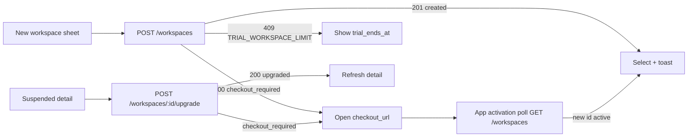

# Osaurus Workspaces (client)

Workspaces are Osaurus Router's shared-team surface: a roster of members, a
set of shared agents, and a monthly credit pool that funds the calls those
agents make. This document describes how the macOS app renders the Router's
Workspaces contract, which lives in the router repository at
`osaurus-router/docs/OSAURUS_WORKSPACES.md` (the router doc is authoritative
for wire shapes; this one is authoritative for what the app does with them).

Related: [Osaurus Router](OSAURUS_ROUTER.md) for identity, request signing,
money representation, and the on-device billing ledger.

## One plan, one trial

There are no tiers. Every workspace is the same product:

- **Plan** — one operator-tunable set of levers from `GET /workspaces/prices`:
  `seats`, `max_shared_agents` (both `null` = unlimited), `monthly_credit_micro`
  / `monthly_credits`, and the read-only `trial_days`.
- **Price** — one live price per interval (`month` / `year`), in micro-USD.
  Launch prices are $20/month and $200/year; the app never hard-codes them.
- **Owner subscription** — one Stripe subscription per account whose quantity
  is the number of subscription-backed workspaces the account owns. Creating or
  reactivating a workspace adds one; deleting removes one (prorated).
- **Trial** — the owner's *first* subscription carries a `trial_days` (default
  14) trial. The card is collected in Checkout and first charged when the trial
  ends. A trialing subscription is `active` and its workspace gets the full
  monthly pool. **One workspace while trialing**: a second `POST /workspaces`
  returns `409 TRIAL_WORKSPACE_LIMIT` with `trial_ends_at`.
- **Pool billing is always on.** Every workspace has a shared monthly credit
  pool; there is no per-member-billed variant.
- **Owners can add to the pool.** One-time top-ups ($5–$500, no fee) and an
  auto-reload rule charged to the card saved on the owner subscription. Bought
  credit never expires; see _Pool credits: top-ups and auto-reload_.

Dollar amounts are formatted by `OsaurusRouterWorkspacePrice.formatUSD(micro:)`
(`"20000000"` → `$20`, `"1999000"` → `$1.99`) and appear only in the plan
picker, the empty state, and the owner billing strip — these are real-money
purchases, the same exception the top-up flow gets in `OSAURUS_ROUTER.md`.

## Types the app reads

`Packages/OsaurusCore/Services/Router/OsaurusRouterWorkspaceTypes.swift`

| Wire field | Swift | Notes |
| --- | --- | --- |
| `entitlement.source` | `OsaurusRouterWorkspaceBillingSource` (`subscription`, `comp`, `suspended`) | `typedSource` on `Entitlement`, `Summary`, and `Detail`. Unknown strings decode to `nil` so a new source degrades to the generic "Inactive"/healthy rendering. |
| `entitlement.active` | `isActive` | The **only** liveness signal. No `tier`, `pool_billed`, or `subscription_status` fallback remains. |
| `entitlement.comp_expires_at`, `next_grant_at`, `seats`, `max_shared_agents`, `monthly_credit_micro` | same names | Facts rendered on the detail view. |
| `GET /workspaces/prices` | `OsaurusRouterWorkspacePricesResponse { plan, prices }` | Unsigned; refreshed alongside billing. |
| `GET /workspaces/billing` | `OsaurusRouterWorkspaceBillingSummary` | `subscription` (`status`, `interval`, `current_period_end`, `cancel_at_period_end`, `trialing`, `trial_ends_at`, …) plus `workspaces`, `billed_workspaces`, `trial_eligible`, `trial_days`. `subscription == nil` means the owner has never subscribed or the subscription is fully canceled. |
| `POST /workspaces`, `POST /workspaces/:id/upgrade` | `OsaurusRouterWorkspaceCreateResponse` | `status` is `created`, `upgraded`, or `checkout_required`; `outcome` is `.ready(detail)` or `.checkoutRequired(activationId:, checkoutURL:)`. |

## Lifecycle states as the app shows them

`WorkspaceStatusBadge` (in `WorkspacesView.swift`) is the single place that
maps entitlement to a label. A healthy, paid, non-trialing workspace has **no**
badge.

| State | How it is detected | Card badge | Detail explainer |
| --- | --- | --- | --- |
| Trial | `active` + `source == subscription` + owner's `billing.subscription.trialing` (owner only — members do not see the owner's billing) | `Trial` | "Free trial — full credit pool now; converts to a paid subscription when the trial ends" + `Trial ends <date>` fact |
| Paid | `active` + `source == subscription` | none | `Renews <date>` or `Subscription ends <date>` when `cancel_at_period_end` |
| Complimentary | `active` + `source == comp` | `Complimentary` | "Complimentary — provided without a subscription until it expires" + `Comp ends <date>` |
| Suspended | `source == suspended` (always `!active`) | `Suspended` | Owner: "your subscription for this workspace ended … until you reactivate it" + **Reactivate…** button. Member: "the owner's subscription ended … only the owner can reactivate it". |
| Comp expired | `!active` + `source == comp` | `Inactive` | Owner: "This complimentary period has ended …" + **Reactivate…**. Member: "… Only the owner can reactivate it." |
| Past due | `!active` + owner's `billing.subscription.status == past_due` | `Past due` | Owner billing strip turns into a "Payment failed" warning with **Manage billing**. Members (who cannot see the owner's billing) get the plain `Inactive` badge and the generic inactive copy. |
| Inactive (other) | `!active`, anything else | `Inactive` | "This workspace isn't active right now. Inviting, sharing, and pool billing are paused until the owner reactivates it." |

Owners additionally get a **billing strip** above the grid (`billingStrip` in
`WorkspacesView.swift`) whenever `billing.subscription != nil`: status, `Trial
ends` / `Renews` / `Subscription ends` date, `N workspaces billed`, the price
per interval, and **Manage billing** (Stripe Billing Portal).

## Purchase flows

All purchase calls are wallet-signed and go through `WorkspacesService`
(`Packages/OsaurusCore/Services/Router/WorkspacesService.swift`). Both
`createWorkspace(name:priceId:)` and `reactivateWorkspace(id:priceId:)` return a
`PurchaseOutcome`:

- `.ready(detail)` — the router returned `201 created` / `200 upgraded`. The
  workspace is selected, audited (`workspaceCreated` / `workspaceReactivated`),
  and the sheet closes.
- `.checkoutOpened(activationId:)` — the router returned `200 checkout_required`.
  The service opens `checkout_url` through its `openURL` seam, sets
  `pendingConfirmation`, and the UI switches to a "finish in your browser"
  state.
- `nil` — the request failed; `lastError` / `lastErrorCode` carry the copy.



### New workspace (`CreateWorkspaceSheet`)

The sheet reads `service.billing` and `service.prices` to pick one of three
shapes before the user types anything:

1. **Live subscription, not trialing** (`hasLiveSubscription && !isTrialing`)
   — name only. Subtitle: "Give it a name. It's added to your subscription and
   ready right away." CTA **Create**. The router answers `201 created`.
2. **Trialing with a workspace already** — same as (1) until the router
   answers `409 TRIAL_WORKSPACE_LIMIT`; the sheet then shows "Your free trial
   covers one workspace. You can add more after it converts on <trial_ends_at>."
   and refreshes billing so the date is current.
3. **No live subscription** — name + a month/year `Picker` fed by `prices`
   (default monthly), a plan card (monthly credits, seat/agent caps or
   "Unlimited …"), and a hint that reads either "N days free, then $X. Your
   card is collected now and first charged when the trial ends." (when
   `trial_eligible`) or "$X, billed by Stripe. You'll finish the purchase in
   your browser." CTA **Start free trial** or **Continue to checkout**.

After `checkoutRequired` the sheet shows "Finish the payment in your browser.
The workspace appears in Osaurus as soon as Stripe confirms it." with **Check
now** and **Stop waiting**. The sheet records the workspace ids it knew before
the Checkout (`idsBeforeCheckout`) and only fires `onCreated` when a genuinely
new id shows up, so a stale selection can never be mistaken for the purchase.

### Return polling

`pendingConfirmation` is an enum, not a flag:

- `.portal` — the selected workspace's owner visited the Billing Portal; poll
  `GET /workspaces/:id` + `GET /workspaces/billing`.
- `.checkout(activationId:, name:, knownIds:)` — a new-workspace Checkout is
  open; poll `GET /workspaces` for an owner-role id not in `knownIds`, then
  select it and toast.
- `.reactivation(workspaceId:)` — a reactivation Checkout is open; poll that
  workspace until `entitlement.active`.
- `.topUp(workspaceId:, topupId:, amountMicro:, balanceBeforeMicro:, startedAt:)`
  — a pool top-up Checkout is open; poll `GET /workspaces/:id/credits/balance`
  + `…/credits/transactions` until a `workspace_topup` ledger entry for that
  amount posted after `startedAt` (1 min skew) is visible, or the balance rose
  by at least the amount (`WorkspacesService.topUpLanded`).

`handleAppActivation()` runs one poll each time the app becomes active (the
user tabbing back from Safari), and `refreshWorkspaces()` also resolves a
pending `.checkout` when the list already contains the new id. Polling
self-limits at `maxConfirmationPolls` (10) fruitless activations so an
abandoned tab cannot spin forever; every syncing row offers **Stop waiting**
(`dismissSubscriptionWait()`), which is idempotent. `.checkout` survives
`clearSelection()` because it is account-level; `.portal`, `.reactivation`,
and `.topUp` are scoped to the selected workspace and clear with it (a top-up
is credited by the webhook whether or not the app is watching).

The Stripe success redirect grants nothing on its own — the router's webhook
creates or reactivates the workspace. The app therefore never trusts the
return URL; it only trusts `GET /workspaces`.

### Reactivate a suspended workspace

Owners of a workspace with `source == suspended` (or an expired comp) see
**Reactivate…** in the detail Overview. It calls `reactivateWorkspace(id:)`:

- With a live subscription the router answers `200 upgraded` and the detail
  refreshes in place (help text: "Adds this workspace back to your subscription
  right away").
- Without one it answers `checkout_required`; the browser opens and the
  Overview shows "Finish the checkout in your browser — this workspace
  reactivates automatically once Stripe confirms." until the poll sees
  `active`.

A `past_due` owner subscription refuses both create and reactivate with
`409 INVALID_STATE` until the card is fixed in the portal; the billing strip
already points there.

### Billing portal

**Manage billing** (`openBillingPortal()`) is offered whenever
`billing.subscription != nil`. It opens `portal_url`, sets
`pendingConfirmation = .portal`, and the detail view shows "Syncing billing
changes — this updates automatically after you return from the billing
portal." until the next poll. Payment method, invoices, cancellation (at period
end), and the month/year switch all happen in the portal, never in the app.

## Pool credits: top-ups and auto-reload

The pool is one ledger account holding two kinds of credit (router doc,
_Credit cycle semantics_): the **monthly grant** (`expiring_micro`, reset at
`next_grant_at`, no rollover) and **purchased credit** (`purchased_micro`:
top-ups and auto-reloads, never expired by a reset or a suspension). Spend is
attributed to the grant first.

### What the app reads

- `GET /workspaces/:id/credits/balance` → `OsaurusRouterWorkspacePoolBalance`
  (`balance_micro`, `expiring_micro`, `purchased_micro`,
  `auto_reload: { enabled, paused }`, `frozen`). `WorkspacesService.poolBalance`
  is loaded with the detail on `selectWorkspace` / `refreshSelectedWorkspace`
  (best-effort — a pre-0041 router only sends the total, and `hasBreakdown` is
  `false`). The Overview hero shows the total from it, and a breakdown line
  "N from this month's grant · N purchased (never expire)" whenever there is
  purchased credit to tell apart. `WorkspacePoolActivityView` shows the same
  split under the balance and labels `workspace_topup` ledger rows
  "Pool top-up".
- `GET /workspaces/billing` now carries `payment_method_on_file`
  (`OsaurusRouterWorkspaceBillingSummary.paymentMethodOnFile`) — whether the
  owner subscription has a card mirrored from Stripe, i.e. whether auto-reload
  can be enabled.
- Any member sees an **Auto-reload on** / **Auto-reload paused** chip next to
  the breakdown (from `balance.auto_reload`); only the owner gets the buttons.

### Add credits (`WorkspacePoolTopUpSheet`, owner only)

**Add credits…** on the Overview (hidden while `source == suspended`: the
router refuses with `402 SUBSCRIPTION_INACTIVE`). Presets **$20 / $50 / $100**
fill a single dollar field; the client validates **$5–$500, whole cents**
(`OsaurusRouterWorkspacePoolCredits.validateTopUp`) before anything is sent.
`WorkspacesService.topUpPool(workspaceId:amountMicro:)` calls
`POST /workspaces/:id/credits/checkout` `{ amount_micro }`, opens
`checkout_url`, and sets `pendingConfirmation = .topUp(...)`. The sheet flips
to "Finish the payment in your browser…" and closes itself when the pending
state clears. No fee: `total_micro == credit_micro`. The card used is saved on
the owner subscription (the sheet says so when `payment_method_on_file` is
false), which is what makes auto-reload available afterwards. The confirmed
top-up is recorded in the audit log as `pool.topup` with `topup_id` and
`amount_micro`.

### Auto-reload (`WorkspaceAutoReloadSheet`, owner writes, any member reads)

**Auto-reload…** on the Overview. `loadAutoReload(workspaceId:)` reads
`GET /workspaces/:id/credits/auto-reload` into `WorkspacesService.autoReload`;
`saveAutoReload(workspaceId:enabled:thresholdMicro:amountMicro:monthlyCapMicro:)`
`PUT`s `OsaurusRouterWorkspaceAutoReloadUpdate`. Presets live in the client,
as the router doc requires: threshold **$5 / $10 / $20**, reload
**$20 / $50 / $100**, default cap **$200**; "Cap reloads per month" unchecked
sends `monthly_cap_micro: null` (always present, never omitted). Client
validation (`validateAutoReload`, honouring the router's `bounds` when loaded):
threshold $1–$500, reload $5–$500, cap `nil` or ≥ reload, whole cents —
a bad config never round-trips. Turning it **off** needs no card and is always
valid.

State the sheet and chip surface, straight from the router semantics:

| Router state | App |
| --- | --- |
| `enabled && !paused` | chip **Auto-reload on**; sheet "On. Reloaded $X so far this month." (`month_reloaded_micro`) |
| `enabled && paused` (3 declines) | chip **Auto-reload paused**; sheet "Paused after N failed charges (last: `<decline code>`). Fix the card under Manage billing, then save to re-arm." — saving (`PUT`) clears the pause and the counter |
| `paused && last_error == "chargeback"` | "Paused after a chargeback on a pool purchase. Saving re-arms it." |
| `last_error == "cap_reached"` | "This month's cap is reached — reloads resume when the month rolls over or you raise the cap." |
| `!enabled && !payment_method_on_file` | "Needs a saved card. Add credits once (the card is saved) or update your card under Manage billing." |

Saving is recorded in the audit log as `pool.auto_reload_changed` with the
`enabled` / `threshold_micro` / `amount_micro` / `monthly_cap_micro` details.

### Out-of-credits in chat

A `402 WORKSPACE_INSUFFICIENT_FUNDS` on a pool-billed request triggers an
immediate auto-reload attempt on the router (when armed), so the chat copy
says: "This workspace's pool is out of credits. If the owner turned on
auto-reload it refills in a moment — send again shortly. Otherwise ask the
owner to add credits, or turn off workspace billing for this agent in
Settings → Workspaces." There is still **no fallback to personal credits** and
no personal top-up prompt. The app does not auto-retry the request; the user
resends once the balance shows the reload.

## Deep links

`WorkspacesDeepLinkRouter.swift` handles two `osaurus://` links. Both are
secondary to the in-app flows above.

- `osaurus://workspaces/activate?code=<code>[&name=…][&plan=…]` — an
  activation code from a **web** purchase on osaurus.ai or an admin comp. The
  app stores it as `PendingWorkspaceActivation` until identity is ready, then
  calls `POST /workspaces/activate`. In-app Checkouts never produce a code.
- `osaurus://workspaces/join?code=<code>` — an invite link minted by an owner
  or admin; calls `POST /workspaces/join`.

## Per-agent pool billing preference

Membership alone does not route an agent's calls to the pool. Each shared
agent has a **Bill the workspace pool** toggle (`WorkspaceSharedAgentRow`)
backed by `WorkspacesService.setBillingWorkspace(agentAddress:workspaceId:)` /
`billingWorkspaceId(forAgentAddress:)` and persisted in `UserDefaults`. When
set, the chat path attaches `workspace_context` so the router bills the pool
and lists the call in the workspace's activity; when unset the call is billed
to the user's own credits and stays personal. A `NOT_A_MEMBER` /
`WORKSPACE_NOT_FOUND` chat failure schedules a reconcile that drops the dead
preference so the next send bills personally.

## Error codes → copy

`WorkspacesService.message(for:)` maps the router's `error.code` to user copy.
Chat-path failures use `ChatErrorMessages.swift`.

| Code | HTTP | Copy |
| --- | --- | --- |
| `TRIAL_WORKSPACE_LIMIT` | 409 | "Your free trial covers one workspace. You can add more once the trial converts to a paid subscription." (the sheet upgrades this to the dated variant using `trial_ends_at`) |
| `SUBSCRIPTION_INACTIVE` | 402/409 | "This workspace isn't active right now. Inviting, sharing, and pool billing are paused until the owner reactivates it." |
| `WORKSPACE_INSUFFICIENT_FUNDS` | 402 | "This workspace's pool is out of credits. The owner can add credits or turn on auto-reload; otherwise it refills at the next monthly grant." (chat copy: see _Out-of-credits in chat_) |
| `INVALID_AUTO_RELOAD_CONFIG` | 400 | "Auto-reload amounts are out of range: threshold $1–$500, reload $5–$500, cap at least the reload amount, all in whole cents." (client validation normally catches this first) |
| `AUTO_RELOAD_UNAVAILABLE` | 409 | "Auto-reload needs an active workspace subscription with a saved card. Add credits once or update the card under Manage billing, then try again." |
| `WORKSPACE_SEATS_EXHAUSTED` | 409 | "This workspace is full. Ask the owner to free a seat." |
| `WORKSPACE_AGENT_LIMIT` | 409 | "This workspace has reached its shared-agent limit." |
| `WORKSPACE_NOT_FOUND` | 404 | "This workspace no longer exists." |
| `NOT_A_MEMBER` | 403 | "You're not a member of this workspace." |
| `FORBIDDEN_ROLE` | 403 | "Your workspace role doesn't allow that action." |
| `INVITE_INVALID` / `INVITE_USED` / `INVITE_EXPIRED` | 404/409/410 | "That invite link isn't valid…" / "This invite link has already been used." / "This invite link has expired…" |
| `ACTIVATION_CODE_INVALID` / `ACTIVATION_CODE_USED` / `ACTIVATION_CODE_EXPIRED` | 404/409/410 | "That activation link isn't valid…" / "This subscription was already activated on another account." / "This activation link has expired. Start a new subscription on osaurus.ai." |
| `ACTIVATION_CONFLICT` | 409 | "This account already has a workspace subscription. Add workspaces from the Workspaces tab, or activate the code on another account." |
| `INVALID_AGENT_PROOF` | 401 | "The agent ownership proof was rejected. Check your clock and try again." |

Legacy codes that the client no longer handles: `FREE_WORKSPACE_LIMIT` (no
free tier), and the `POST /workspaces/:id/downgrade` route (`410 GONE`).

## Router deployment the client depends on

The app is only correct against a router that has applied migration
`0040_single_plan_trial.sql` and the launch checklist in the router doc. The
pieces the client observes directly:

- `GET /workspaces/prices` returns `plan` (with `trial_days`) and both live
  prices. Without prices the create sheet still works — it falls back to the
  router's default (monthly) price — but shows no amounts.
- `WORKSPACES_TRIAL_DAYS` (default 14; `0` disables the trial). The app reads
  the effective value from `plan.trial_days` / `billing.trial_days`; it never
  assumes 14.
- `WORKSPACES_CHECKOUT_SUCCESS_URL`, `WORKSPACES_CHECKOUT_CANCEL_URL`,
  `WORKSPACES_PORTAL_RETURN_URL` — https return pages for in-app Checkouts and
  the portal. The app does not pass `success_url` / `cancel_url` itself; it
  relies on these defaults and on activation polling, so the pages only need
  to tell the user to return to Osaurus.
- Migration `0041_workspace_topups.sql` for pool top-ups and auto-reload
  (`workspace_topup` ledger entries, `topups.workspace_id`,
  `default_payment_method_id`, `workspace_auto_reload`). Against a pre-0041
  router the balance endpoint has no split (`hasBreakdown == false`, no chip),
  and the top-up / auto-reload routes 404 — the sheets surface the server
  error and nothing is charged.
- Stripe webhooks (`checkout.session.completed`, `checkout.session.expired`,
  `payment_intent.succeeded`, `payment_intent.payment_failed`,
  `charge.refunded`, `charge.dispute.created`, `invoice.paid`,
  `invoice.payment_failed`, `customer.subscription.*`) must be live — the app's
  return polls are waiting on them; the two `payment_intent.*` events are what
  confirm pool top-ups and auto-reload charges.
- `WORKSPACES_WEB_SERVICE_TOKEN` + `WORKSPACES_ACTIVATION_*_URL` only matter for
  the web-purchase / activation-code path.
- `WORKSPACES_ATTESTATION_KEY` is required for shared-agent access (unchanged
  by the single-plan cutover).

## Regression coverage

`Packages/OsaurusCore/Tests/Router/OsaurusWorkspacesTests.swift`:

- `Workspaces wire types` — `source` / `entitlement` decoding without `tier`,
  `pool_billed`, or `subscription_status`; create-response outcomes; price
  formatting; `TRIAL_WORKSPACE_LIMIT` matching; billing summary trial fields;
  `WorkspaceStatusBadge` mapping.
- `Workspaces API client` — `POST /workspaces` (201 created, 200
  checkout_required, 409 trial limit), `POST /workspaces/:id/upgrade`, unsigned
  `GET /workspaces/prices`, `POST /workspaces/:id/credits/checkout` (body,
  402 on a suspended pool), `GET`/`PUT /workspaces/:id/credits/auto-reload`
  (exact body with `monthly_cap_micro: null`, 409 `AUTO_RELOAD_UNAVAILABLE`).
- `Workspaces wire types` also covers the pool balance split and its legacy
  (total-only) shape, the top-up Checkout response, auto-reload
  settings/state/bounds decoding, the update body encoding, and the client
  presets/bounds (`OsaurusRouterWorkspacePoolCredits`).
- `Workspaces service` — immediate create, Checkout open + `pendingConfirmation`
  + activation poll landing on the new workspace, reactivation outcomes, portal
  round-trip, "Stop waiting", error copy; pool balance loaded with the
  selection; top-up bounds rejected locally; top-up Checkout open → poll that
  ignores an older same-amount ledger entry and settles on the fresh one;
  `topUpLanded` freshness/fallback rules; auto-reload save rejected locally on
  a cap below the reload, saved and mirrored into `poolBalance`, and the
  no-card verdict copy.
- `Workspace billed inference` — `workspace_context` attachment and the
  `NOT_A_MEMBER` self-heal.

Tier-free fixtures also live in `WorkspaceRosterStoreTests`,
`SharedAgentSurfacesTests`, `SharedAgentIdentityTests`, and
`ChatWindowStateWorkspaceAgentTests`.

Run them with:

```bash
OSAURUS_DISABLE_KEYCHAIN_FOR_TESTS=1 \
OSAURUS_TEST_ROOT=/tmp/osaurus-test \
OSU_MODELS_DIR=/tmp/osaurus-test-models \
swift test --package-path Packages/OsaurusCore --filter "Workspace|SharedAgent"
```

Live proof (required before calling a release production-ready, per
`AGENTS.md`): against a router on migration 0040 with Stripe test mode, create
→ Checkout → return → workspace appears with the `Trial` badge; reactivate a
suspended workspace both with and without a live subscription; portal
round-trip clears the syncing row; `TRIAL_WORKSPACE_LIMIT` renders the dated
hint.
