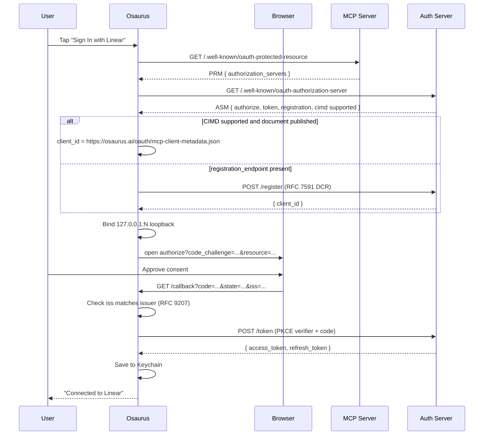

# Remote MCP Providers

Remote MCP Providers connect Osaurus to external MCP (Model Context Protocol) servers and aggregate their tools into your local Osaurus instance. The model can then call those remote tools the same way it calls local plugins.

This is different from [Remote Providers](REMOTE_PROVIDERS.md) (which provide _inference_ endpoints). Remote MCP Providers provide **tools**.

Remote MCP Providers are client connections to MCP tool servers. Osaurus can
connect to HTTP/SSE MCP endpoints and can also launch configured stdio MCP
subprocesses. Command-based stdio is supported in the opposite direction too:
external MCP clients can launch Osaurus with `osaurus mcp` to use Osaurus as
their MCP server.

---

## Supported Transports

| Direction | Transport | Status | How to configure |
| --- | --- | --- | --- |
| External MCP client -> Osaurus | Stdio command | Supported | Configure the client with `command: "osaurus"` and `args: ["mcp"]`. |
| External MCP client -> Osaurus | HTTP endpoints | Supported | Use `GET /mcp/tools` and `POST /mcp/call` on the local Osaurus server. |
| Osaurus -> remote MCP provider | HTTP endpoint | Supported | Add a provider URL in **Custom Server** or choose a catalog template. |
| Osaurus -> remote MCP provider | HTTP streaming / SSE | Supported when the server supports it | Enable **Streaming Enabled** in Advanced. |
| Osaurus -> third-party local MCP provider | Stdio command | Supported | Choose **Stdio** in Custom Server and configure command, args, env, execution host, and working directory. |

If a vendor publishes a stdio config such as `{"command": "npx", "args": [...]}`,
enter that command in the Stdio editor. The **Test** button launches the
subprocess, runs the MCP initialize/listTools flow, reports the tool count or
spawn/protocol error, and tears the subprocess down. For host-executed stdio
providers, GUI apps may not inherit your shell `PATH`; use a full executable
path such as `/opt/homebrew/bin/npx` when a command-not-found diagnostic appears.

---

## Adding a Provider

The Add Provider sheet is a two-step flow.

### Step 1 — Pick a service

`⌘ Shift M` → **Tools** → **Connections** tab → **+ Add Provider**.

> Note: this is the **Tools** sidebar item (under Agents & Automation), not the top-level **Providers** item — that one manages _inference_ endpoints (Ollama, OpenAI-compatible, etc.), not MCP tool servers. See [Remote Providers](REMOTE_PROVIDERS.md) for the difference.

You land on a catalog grid with a search bar and a row of category chips at the top (Legal, Finance & Accounting, Investing & Market Data, Healthcare & Life Sciences, Documents & Signatures, Compliance & Security, Business Productivity, Sales & CRM, Developer). Type to filter by name, tagline, or category ("issues" finds Linear, "legal" finds every legal service). Enterprise data products carry a **Requires subscription** note; they only work with a paid account. The first card is always **Custom Server** for any HTTP(S) MCP endpoint you want to point at; the rest are pre-vetted well-known providers (see [Provider Catalog](#provider-catalog) below).

### Step 2 — Connect

Tapping a card takes you to one of these configure screens depending on what the vendor supports.

#### OAuth 2.1 (with Dynamic Client Registration)

Used by most of the catalog (every row marked plain **OAuth** in the [Provider Catalog](#provider-catalog)).

- One big **Sign In with [Provider]** button.
- Tap it → your default browser opens to the vendor's OAuth consent screen.
- After you approve, the browser redirects back to a loopback URL Osaurus is listening on (`http://127.0.0.1:<ephemeral>/callback`).
- A green **Connected** badge appears.
- Click **Add Provider**. Done.

No client ID, secret, or redirect URI to configure. Osaurus picks a client registration in this order (see [`MCPOAuthClientMetadata.swift`](../Packages/OsaurusCore/Services/MCP/OAuth/MCPOAuthClientMetadata.swift)):

1. A `client_id` already saved for this provider, but only if it was issued by the same authorization server (`issuer`). A changed issuer forces a fresh registration.
2. A [Client ID Metadata Document](https://modelcontextprotocol.io/specification/2025-11-25/basic/authorization) (CIMD) when the authorization server advertises `client_id_metadata_document_supported`. The `client_id` is the URL `https://osaurus.ai/oauth/mcp-client-metadata.json`; the source of that document is [`docs/oauth/mcp-client-metadata.json`](oauth/mcp-client-metadata.json). Osaurus fetches and validates the published copy before using it (cached per launch, failures retried after 10 minutes), so until it is live this step is skipped.
3. [RFC 7591 Dynamic Client Registration](https://datatracker.ietf.org/doc/html/rfc7591) when the server publishes a `registration_endpoint`.

Templates whose server accepts **only** CIMD (MyCase, Ironclad, Wealthbox, Affinity, Crunchbase, Financial Modeling Prep) are hidden from the directory until the metadata document is published.

After the browser redirect, Osaurus checks the `iss` parameter ([RFC 9207](https://datatracker.ietf.org/doc/html/rfc9207)): a different issuer stops sign-in, and a missing one stops it only when the server advertises `authorization_response_iss_parameter_supported`.

Servers built against MCP 2025-03-26 publish no protected-resource metadata. For those, Osaurus reads authorization-server metadata from the MCP server's origin instead (Intercom works this way).

#### OAuth 2.1 (manual Client ID + Client Secret)

Used by HubSpot, Google Drive, Gmail, Google Calendar, Slack, Asana, Zoom, Xero, Box, and Docusign.

Some vendors require confidential-client OAuth and don't publish a `registration_endpoint`, so DCR can't bootstrap a client. For these the connect-known sheet renders an extra setup card:

1. Click **Open [Provider] docs** to land on the vendor's OAuth-app instructions.
2. Register a new OAuth app and **copy this exact redirect URI** into its allowed list — the sheet shows it with a **Copy** button. Every manual-credentials template uses `http://127.0.0.1:33267/callback`.
3. Paste the resulting **Client ID** and **Client Secret** into the form.
4. Click **Sign In with [Provider]**, complete the browser flow, then **Add Provider**.

The Client Secret is stored in your macOS Keychain alongside access/refresh tokens and is sent only to the vendor's token endpoint: in the form body (`client_secret_post`), or as HTTP Basic credentials when the token endpoint only advertises `client_secret_basic` (Zoom). The loopback port is pinned to the value the vendor expects, so future refreshes keep working without re-registering the app.

> Vendor notes:
> - **Google** (Drive, Gmail, Calendar): enable the MCP API for each product in a Google Cloud project, configure the OAuth consent screen with the product's scopes, and create a **Desktop app** OAuth client.
> - **Slack**: only internal or Slack Marketplace apps can use MCP. Create an app, add the redirect URL, turn on the MCP feature under Agents & AI Apps, and install it to your workspace.
> - **Asana**: create an **MCP app** in the Asana developer console.
> - **Zoom**: create a **General app** in the Zoom App Marketplace and add the scopes for the tools you need.
> - **Xero**: create a web app in the Xero developer portal.
> - **Box**: an admin adds Integration Credentials for the Custom Box MCP Server in the Box Admin Console.
> - **Docusign**: create an integration key with a secret key in Apps and Keys. The template targets production accounts (`mcp.docusign.com`); developer accounts use `https://mcp-d.docusign.com/mcp` via Custom Server.
>
> HubSpot specifics — Create your app at **HubSpot Developer Portal → Development → MCP Auth Apps**, paste `http://127.0.0.1:33267/callback` as the redirect URL, and copy the issued Client ID + Client Secret. Private App PATs (`pat-na1-…`) do not authenticate against `mcp.hubspot.com` and will return 401 — they only work with HubSpot's REST APIs and the self-hosted Developer MCP npm package.

#### API Key (bearer token)

Used by GitHub Copilot MCP.

- A secure text field labeled **API Key**.
- A **Where do I get my key?** link that opens the vendor's docs.
- Paste the key, click **Add Provider**.

The key is written to your macOS Keychain (never to disk in plaintext) and sent on every request as `Authorization: Bearer <key>`.

#### No Auth

Used by public data sources: TaxAct, SNOMED CT, Open Targets, Excalidraw, DeepWiki, Exa Search, and Keenable.

- A small green **This server doesn't require authentication.** confirmation.
- Click **Add Provider**.

#### Custom Server

The freeform editor — Name, URL, Auth picker (None / Bearer Token / OAuth), Custom Headers, Advanced (timeouts, streaming, auto-connect). Use this for any URL-reachable MCP server not in the catalog, or to override fine-grained settings on one that is.

Custom Server supports both HTTP/SSE and stdio. HTTP/SSE providers use the
global proxy policy when one is configured. Stdio providers run a local
subprocess and therefore do not send traffic through URLSession's proxy path.
The Test button now records a provider health snapshot after the explicit
initialize/listTools probe. The copied probe result includes the stable reason
code (`succeeded`, `invalidURL`, `missingCommand`, `commandNotFound`,
`sandboxUnavailable`, `spawnFailed`, `timeout`, `authRequired`,
`protocolError`, or `connectionFailed`) plus the stage that failed, but never
includes credentials, env values, headers, request bodies, or tokens.

---

## Provider Catalog

The catalog is hardcoded in [`MCPProviderTemplate.swift`](../Packages/OsaurusCore/Models/Configuration/MCPProviderTemplate.swift). Templates are pure UI prefills — saving from one produces an `MCPProvider` record identical to one you would build by hand, so removing or editing a template later never affects already-saved providers.

| Service | Category | Auth | Subscription | Endpoint |
| --- | --- | --- | --- | --- |
| **Bloomberg Law** | Legal | OAuth | Yes | `https://gw.mcp.bindg.ai/blaw/mcp` |
| **CoCounsel Legal** | Legal | OAuth | Yes | `https://cocoagent-service.cocounsel.thomsonreuters.com/mcp` |
| **CourtListener** | Legal | OAuth |  | `https://mcp.courtlistener.com/` |
| **Datasite** | Legal | OAuth | Yes | `https://mcp.global.datasite.com/mcp` |
| **Definely** | Legal | OAuth | Yes | `https://mcp.app.definely.com/` |
| **Descrybe** | Legal | OAuth |  | `https://mcp.descrybe.com/mcp` |
| **Harvey** | Legal | OAuth (Harvey-issued credentials) | Yes | `https://api.harvey.ai/hosted_mcp/mcp` |
| **iManage Work** | Legal | OAuth | Yes | `https://cloudimanage.com/mcp/work` |
| **Ironclad** | Legal | OAuth (CIMD, hidden until published) | Yes | `https://mcp.na1.ironcladapp.com/mcp` |
| **Juro** | Legal | OAuth | Yes | `https://integrations.app.juro.com/mcp` |
| **LawVu** | Legal | OAuth | Yes | `https://mcp.lawvu.com/mcp` |
| **Legal Data Hunter** | Legal | OAuth |  | `https://legaldatahunter.com/mcp` |
| **LegalZoom** | Legal | OAuth |  | `https://www.legalzoom.com/mcp/claude/v1` |
| **Midpage** | Legal | OAuth | Yes | `https://app.midpage.ai/mcp` |
| **MyCase** | Legal | OAuth (CIMD, hidden until published) | Yes | `https://mcp.mycase.com/mcp` |
| **NetDocuments** | Legal | OAuth | Yes | `https://web-api.us.netdocuments.app/connect/mcp` |
| **Brex** | Finance & Accounting | OAuth | Yes | `https://api.brex.com/mcp` |
| **Carta** | Finance & Accounting | OAuth | Yes | `https://mcp.app.carta.com/mcp` |
| **Datarails** | Finance & Accounting | OAuth | Yes | `https://mcp.datarails.com/mcp` |
| **Deel** | Finance & Accounting | OAuth | Yes | `https://api.letsdeel.com/mcp` |
| **Digits** | Finance & Accounting | OAuth | Yes | `https://api.digits.com/mcp` |
| **DualEntry** | Finance & Accounting | OAuth | Yes | `https://api.dualentry.com/mcp` |
| **FreshBooks** | Finance & Accounting | OAuth |  | `https://mcp.freshbooks.com/v1` |
| **GoCardless** | Finance & Accounting | OAuth |  | `https://mcp.gocardless.com/` |
| **Gusto** | Finance & Accounting | OAuth |  | `https://mcp.api.gusto.com` |
| **Mercury** | Finance & Accounting | OAuth |  | `https://mcp.mercury.com/mcp` |
| **MYOB** | Finance & Accounting | OAuth |  | `https://mcp.myob.com/mcp` |
| **PayPal** | Finance & Accounting | OAuth |  | `https://mcp.paypal.com/mcp` |
| **PocketSmith** | Finance & Accounting | OAuth |  | `https://mcp.pocketsmith.com/mcp` |
| **Qonto** | Finance & Accounting | OAuth |  | `https://mcp.qonto.com/mcp` |
| **QuickBooks** | Finance & Accounting | OAuth |  | `https://mcp.quickbooks.intuit.com/mcp` |
| **Ramp** | Finance & Accounting | OAuth | Yes | `https://ramp-mcp-remote.ramp.com/mcp` |
| **Rillet** | Finance & Accounting | OAuth | Yes | `https://api.rillet.com/mcp` |
| **Square** | Finance & Accounting | OAuth |  | `https://mcp.squareup.com/mcp` |
| **Stripe** | Finance & Accounting | OAuth |  | `https://mcp.stripe.com` |
| **TaxAct** | Finance & Accounting | None |  | `https://mcp.taxact.com/mcp` |
| **Tiller** | Finance & Accounting | OAuth |  | `https://ai-tools.tillermoney.com/mcp` |
| **Xero** | Finance & Accounting | OAuth (your app) |  | `https://mcp.xero.com/mcp` |
| **Zoho Books** | Finance & Accounting | OAuth |  | `https://claude-zohobooks.zohomcp.com/mcp/message` |
| **Addepar** | Investing & Market Data | OAuth | Yes | `https://mcp.addepar.com/` |
| **Affinity** | Investing & Market Data | OAuth (CIMD, hidden until published) | Yes | `https://mcp.affinity.co/mcp` |
| **Alpha Vantage** | Investing & Market Data | OAuth |  | `https://mcp.alphavantage.co/mcp` |
| **Crunchbase** | Investing & Market Data | OAuth (CIMD, hidden until published) |  | `https://mcp.crunchbase.com/` |
| **Daloopa** | Investing & Market Data | OAuth | Yes | `https://mcp.daloopa.com/server/mcp` |
| **FactSet** | Investing & Market Data | OAuth | Yes | `https://mcp.factset.com/content/v1` |
| **Financial Modeling Prep** | Investing & Market Data | OAuth (CIMD, hidden until published) |  | `https://financialmodelingprep.com/mcp` |
| **LSEG** | Investing & Market Data | OAuth | Yes | `https://api.analytics.lseg.com/lfa/mcp/server-cl` |
| **Moody's** | Investing & Market Data | OAuth | Yes | `https://mcp.moodys.com/genai-ready-data/Credit/mcp` |
| **Morningstar** | Investing & Market Data | OAuth | Yes | `https://mcp.morningstar.com/mcp` |
| **PitchBook** | Investing & Market Data | OAuth | Yes | `https://premium.mcp.pitchbook.com/mcp` |
| **S&P Global** | Investing & Market Data | OAuth | Yes | `https://kfinance.kensho.com/integrations/mcp` |
| **Wealthbox** | Investing & Market Data | OAuth (CIMD, hidden until published) | Yes | `https://mcp.crmworkspace.com/mcp` |
| **Consensus** | Healthcare & Life Sciences | OAuth |  | `https://mcp.consensus.app/mcp` |
| **Cortellis Regulatory** | Healthcare & Life Sciences | OAuth | Yes | `https://api.clarivate.com/lifesciences/mcp-regulatory/mcp` |
| **Elicit** | Healthcare & Life Sciences | OAuth |  | `https://elicit.com/api/mcp` |
| **HealthEx** | Healthcare & Life Sciences | OAuth |  | `https://api.healthex.io/mcp` |
| **Medidata** | Healthcare & Life Sciences | OAuth | Yes | `https://mcp.imedidata.com/mcp` |
| **Open Targets** | Healthcare & Life Sciences | None |  | `https://mcp.platform.opentargets.org/mcp` |
| **Scite** | Healthcare & Life Sciences | OAuth |  | `https://api.scite.ai/mcp` |
| **SNOMED CT** | Healthcare & Life Sciences | None |  | `https://snowstorm-mcp.snomedtools.org/mcp` |
| **Turquoise Health** | Healthcare & Life Sciences | OAuth |  | `https://mcp.turquoise.health/mcp` |
| **Wiley Scholar Gateway** | Healthcare & Life Sciences | OAuth |  | `https://connector.scholargateway.ai/v2/mcp` |
| **Box** | Documents & Signatures | OAuth (your app) | Yes | `https://mcp.box.com/` |
| **Docusign** | Documents & Signatures | OAuth (your app) |  | `https://mcp.docusign.com/mcp` |
| **Dropbox** | Documents & Signatures | OAuth |  | `https://mcp.dropbox.com/mcp` |
| **Egnyte** | Documents & Signatures | OAuth | Yes | `https://mcp-server.egnyte.com/mcp` |
| **PandaDoc** | Documents & Signatures | OAuth |  | `https://mcp.pandadoc.com/v1/mcp` |
| **SignNow** | Documents & Signatures | OAuth |  | `https://mcp-server.signnow.com/mcp` |
| **iubenda** | Compliance & Security | OAuth |  | `https://mcp-server.iubenda.com/mcp` |
| **Vanta** | Compliance & Security | OAuth | Yes | `https://mcp.vanta.com/mcp` |
| **Airtable** | Business Productivity | OAuth |  | `https://mcp.airtable.com/mcp` |
| **Asana** | Business Productivity | OAuth (your app) |  | `https://mcp.asana.com/v2/mcp` |
| **Atlassian** | Business Productivity | OAuth |  | `https://mcp.atlassian.com/v2/mcp` |
| **Calendly** | Business Productivity | OAuth |  | `https://mcp.calendly.com/` |
| **Canva** | Business Productivity | OAuth |  | `https://mcp.canva.com/mcp` |
| **ClickUp** | Business Productivity | OAuth |  | `https://mcp.clickup.com/mcp` |
| **DeepL** | Business Productivity | OAuth |  | `https://mcp.deepl.com/v1/mcp` |
| **Dropbox Dash** | Business Productivity | OAuth | Yes | `https://mcp.dropbox.com/dash` |
| **Exa Search** | Business Productivity | None |  | `https://mcp.exa.ai/mcp` |
| **Excalidraw** | Business Productivity | None |  | `https://mcp.excalidraw.com/mcp` |
| **Fireflies** | Business Productivity | OAuth |  | `https://api.fireflies.ai/mcp` |
| **Gamma** | Business Productivity | OAuth |  | `https://mcp.gamma.app/mcp` |
| **Gmail** | Business Productivity | OAuth (your app) |  | `https://gmailmcp.googleapis.com/mcp/v1` |
| **Google Calendar** | Business Productivity | OAuth (your app) |  | `https://calendarmcp.googleapis.com/mcp/v1` |
| **Google Drive** | Business Productivity | OAuth (your app) |  | `https://drivemcp.googleapis.com/mcp/v1` |
| **Granola** | Business Productivity | OAuth |  | `https://mcp.granola.ai/mcp` |
| **Keenable** | Business Productivity | None |  | `https://api.keenable.ai/mcp` |
| **Microsoft 365** | Business Productivity | OAuth (your Entra app) | Yes | `https://workiq.svc.cloud.microsoft/mcp` |
| **Miro** | Business Productivity | OAuth |  | `https://mcp.miro.com/` |
| **monday.com** | Business Productivity | OAuth |  | `https://mcp.monday.com/mcp` |
| **Notion** | Business Productivity | OAuth |  | `https://mcp.notion.com/mcp` |
| **Slack** | Business Productivity | OAuth (your app) |  | `https://mcp.slack.com/mcp` |
| **Todoist** | Business Productivity | OAuth |  | `https://ai.todoist.net/mcp` |
| **Trello** | Business Productivity | OAuth |  | `https://mcp.trello.com/v1` |
| **Webflow** | Business Productivity | OAuth |  | `https://mcp.webflow.com/mcp` |
| **Zapier** | Business Productivity | OAuth |  | `https://mcp.zapier.com/api/mcp/mcp` |
| **Zoom** | Business Productivity | OAuth (your app) |  | `https://mcp.zoom.us/mcp/zoom/streamable` |
| **Attio** | Sales & CRM | OAuth |  | `https://mcp.attio.com/mcp` |
| **Close** | Sales & CRM | OAuth |  | `https://mcp.close.com/mcp` |
| **HubSpot** | Sales & CRM | OAuth (your app) |  | `https://mcp.hubspot.com` |
| **Intercom** | Sales & CRM | OAuth |  | `https://mcp.intercom.com/mcp` |
| **Salesforce** | Sales & CRM | OAuth | Yes | `https://api.salesforce.com/platform/mcp/v1/platform/headless-360` |
| **Buildkite** | Developer | OAuth |  | `https://mcp.buildkite.com/mcp` |
| **Cloudflare** | Developer | OAuth |  | `https://mcp.cloudflare.com/mcp` |
| **Cloudinary** | Developer | OAuth |  | `https://asset-management.mcp.cloudinary.com/mcp` |
| **DeepWiki** | Developer | None |  | `https://mcp.deepwiki.com/mcp` |
| **GitHub** | Developer | API Key |  | `https://api.githubcopilot.com/mcp/` |
| **Hugging Face** | Developer | OAuth |  | `https://huggingface.co/mcp` |
| **Linear** | Developer | OAuth |  | `https://mcp.linear.app/mcp` |
| **Neon** | Developer | OAuth |  | `https://mcp.neon.tech/mcp` |
| **Netlify** | Developer | OAuth |  | `https://netlify-mcp.netlify.app/mcp` |
| **Sentry** | Developer | OAuth |  | `https://mcp.sentry.dev/mcp` |
| **Supabase** | Developer | OAuth |  | `https://mcp.supabase.com/mcp` |
| **Vercel** | Developer | OAuth |  | `https://mcp.vercel.com/` |

Every URL was probed live on October 3, 2026. Re-run the read-only probe with `scripts/live-proof/probe-mcp-templates.sh` (unauthenticated `initialize` plus OAuth discovery; for servers that need no sign-in it also lists tools and makes one anonymous tool call, and reports `CALLAUTH` when that call is refused; it exits non-zero if any template URL is dead). If a vendor changes their endpoint, you can always tap **Custom Server** and enter the new one without an app update.

### Why some popular providers are missing

The catalog only includes providers whose remote MCP server supports either:

- OAuth 2.1 with Dynamic Client Registration ([RFC 7591](https://datatracker.ietf.org/doc/html/rfc7591)) or a Client ID Metadata Document, or
- OAuth 2.1 with a publicly documented OAuth-app registration the user can complete themselves (manual Client ID + Client Secret), or
- a documented bearer-token / API-key fallback (GitHub), or
- no authentication at all.

Not in the catalog today:

- **Everlaw**: its authorization server publishes neither client registration nor Client ID Metadata Document support, and Everlaw only issues OAuth clients to the AI apps it partners with.
- **Clio**, **Filevine**, **ADP**, **Bill.com**: no vendor-hosted MCP server. BILL and Gusto's embedded-payroll MCP servers are documentation search only.
- **NetSuite**: the AI connector lives at a per-account URL (`https://<ACCOUNT_ID>.suitetalk.api.netsuite.com/services/mcp/v1/all`), so it can't be a fixed template. Add it with **Custom Server** after your administrator enables it.
- **Lexis+ AI Protégé**: the endpoint is not publicly documented.
- **Stack Overflow**: `mcp.stackoverflow.com` publishes no OAuth discovery metadata, so sign-in can't start.
- **Drata**, **Vanguard**: endpoints redirect or return 404.
- Endpoints built for a single client (Intuit TurboTax/Credit Karma and `/anthropic` variants) and Anthropic-hosted public-data servers (`*.mcp.claude.com`).
- Multi-step API-key + GCP-IAM services (Google BigQuery, Maps, GKE).

Some catalog entries still need something from your organization before sign-in works:

- **QuickBooks**: Intuit may only accept apps it has approved. If sign-in is refused, ask Intuit about access to the QuickBooks MCP server.
- **Harvey**: ask your Harvey administrator for an OAuth client ID and secret issued for the redirect URI shown in the sign-in form.
- **Microsoft 365** (Work IQ): your Microsoft 365 administrator must register an Entra app with the redirect URI shown in the sign-in form and grant the Work IQ API permissions. Work IQ must be enabled for your tenant.

Use **Custom Server** if you need any of them.

---

## Editing an Existing Provider

Click the row's edit menu. Edit-mode skips the catalog and opens the freeform editor directly so you can change anything (name, URL, auth, headers, timeouts) regardless of whether the provider was originally added from a template.

## Provider Diagnostics

Each provider row has a copyable diagnostics section in the expanded details.
It reports connection state, auth mode, transport, proxy policy, and the best
repro path. The copied text is safe to paste in an issue or Discord thread; it
does not include bearer tokens, OAuth tokens, request bodies, env values, or raw
headers.

The top of the Providers page includes an **MCP Server Hub** summary when at
least one provider exists. It aggregates connected, attention, tool, stdio, and
host-stdio counts, and the segmented filter lets you narrow the row list to all,
attention, connected, stdio, HTTP, or disabled providers. The hub actions can
probe every enabled provider, reconnect every enabled provider, or copy a single
redacted support report for the whole provider set.

For stdio providers, diagnostics distinguish sandbox vs host execution and point
command-not-found failures at the executable path/PATH fix. For HTTP/SSE
providers, diagnostics show whether the global proxy is active, disabled, or
ignored because the saved URL failed validation. Local MCP rows also include the
last explicit health snapshot and a capture-policy row. The capture row is policy
only for remote-provider tools: screenshot/capture access remains off unless a
trusted plugin is installed, enabled, opted in by the user, granted permission,
and invoked interactively. The in-app `/screenshot` command is separate from
remote MCP providers and is not exposed through external tool surfaces.

---

## Configuration Reference

### Connection (always shown)

| Setting     | Description                         |
| ----------- | ----------------------------------- |
| **Name**    | Display name for the provider       |
| **URL**     | Full HTTP(S) URL to the MCP server endpoint |
| **Enabled** | Whether the provider is active      |

### Authentication

| Mode             | Description                                                                                                                                |
| ---------------- | ------------------------------------------------------------------------------------------------------------------------------------------ |
| **None**         | No `Authorization` header added.                                                                                                           |
| **Bearer Token** | Token sent as `Authorization: Bearer <token>`. Stored in macOS Keychain.                                                                   |
| **OAuth**        | RFC 9728 PRM + RFC 8414 ASM discovery, Client ID Metadata Documents or RFC 7591 DCR, RFC 8252 loopback redirect, PKCE S256, RFC 8707 resource indicators, RFC 9207 `iss` check, auto refresh. |

### Custom Headers

Add arbitrary HTTP headers. Mark a header as a **secret** to store its value in Keychain instead of `mcp.json`.

### Advanced

| Setting               | Description                               | Default |
| --------------------- | ----------------------------------------- | ------- |
| **Auto-connect**      | Connect automatically when Osaurus starts | true    |
| **Streaming Enabled** | Use the streaming/SSE HTTP transport when the server supports it | false   |
| **Discovery Timeout** | Timeout for tool discovery (seconds)      | 20      |
| **Tool Call Timeout** | How long a tool call may go without any sign of progress (seconds) | 45; 120 for Legal, Investing, and Healthcare templates |

Both timeouts are enforced at the MCP layer. Every tool call sends a
progress token. Each `notifications/progress` update from the server restarts
the tool-call timeout, up to a hard cap of 10 minutes per call, and the
latest progress message (with a percentage when the server sends a total)
appears on the running tool card. The timeout is also paused while the
server is waiting for you to answer a request (see
[Requests from a connector](#requests-from-a-connector-elicitation)); the
10-minute cap still applies. The underlying HTTP session uses a looser idle timeout (at least the larger of the two, minimum 60s) so it
never undercuts a long-running tool call, and it does not cap the total
lifetime of the streaming SSE connection.

---

## How OAuth Auto Sign-In Works



The implementation lives in [`Packages/OsaurusCore/Services/MCP/OAuth/`](../Packages/OsaurusCore/Services/MCP/OAuth/) and uses the shared loopback server in [`Packages/OsaurusCore/Services/Auth/OAuthLoopbackServer.swift`](../Packages/OsaurusCore/Services/Auth/OAuthLoopbackServer.swift).

### Token Refresh & 401 Recovery

- Access tokens are refreshed proactively before they expire.
- If a request returns `401 Unauthorized`, Osaurus probes the response's `WWW-Authenticate: Bearer` challenge, refreshes once, and retries. If that also fails, the provider's row surfaces a "Sign in again" prompt.
- All tokens (access + refresh) live in Keychain; `mcp.json` only stores client IDs and metadata.
- A `401`/`403` **without** a `WWW-Authenticate` header (common on servers that only accept static API tokens) is still classified as an auth failure — the provider row shows an auth-specific message including the server's JSON-RPC error, instead of a generic connection error.
- An OAuth challenge on a provider configured with an **API Key** never converts it to OAuth: the row keeps the inline token field and reports that the saved token was rejected. Servers like `runalyze.com/mcp` advertise OAuth in their 401 challenge while also accepting personal API tokens.

### Session Expiry Recovery (tool calls)

Remote streamable-HTTP servers expire their `Mcp-Session-Id` after idle
periods or server restarts, and OAuth access tokens can expire while a
provider stays connected. When a tool call fails with a session-expired,
authentication, or closed-connection error, Osaurus automatically reconnects
once — rebuilding the transport with fresh credentials and negotiating a new
session — and retries the call. Timeouts are never retried, because the
server may already have executed the tool. If the reconnect fails, the
provider row shows the reconnect error (for example the "Sign in again"
prompt) instead of silently staying green.

### Sign-in Required at Call Time

Some servers list their tools without sign-in and only ask for it when a tool
runs (Descrybe does this). If a tool call still returns `401` after the
reconnect-and-retry above, Osaurus marks the provider as needing sign-in, the
provider row shows **Sign In**, and the model is told to ask you to sign in
from Tools & MCP → Services before trying again.

### Missing Permissions (insufficient_scope step-up)

If an OAuth provider still answers a tool call with `403 Forbidden` after the
reconnect-and-retry above (so the token is fresh but its grant does not cover
the tool), Osaurus marks the provider as needing sign-in. It records the union
of the scopes already granted and any `scope=` from the server's
`WWW-Authenticate` challenge, and the next **Sign In** requests that set.
Re-authorization is never silent: the model is told the user must sign in
again from Tools & MCP → Services.

### Cancellation

When a tool call hits its timeout or the user presses Stop, Osaurus sends
MCP `notifications/cancelled` for that request so the server can stop work.
Cancellation is advisory, so a failed notification never replaces the
original timeout or cancellation error.

---

## How It Works (Tool Discovery & Execution)

### Tool Discovery

When you connect to an MCP provider:

1. Osaurus establishes an HTTP/SSE connection to the MCP server (with bearer / OAuth headers as appropriate).
2. Sends a `tools/list` request to discover available tools.
3. Registers each tool with a namespaced name.
4. Tools become available for model inference.

The provider row's discovered-tool pills use each tool's `title` when the
server sends one, and show the server's behavior hints: an eye for read-only
tools, a warning triangle for tools that declare they can modify or delete
data.

### Approvals From Server Hints

The same hints pick each tool's **default** approval policy:

- A tool the server declares read-only (`readOnlyHint: true`) runs without
  asking, unless it also declares `openWorldHint: true` (web search, page
  fetch), which could carry chat content to third parties.
- A tool that is not declared read-only and not explicitly non-destructive
  (`destructiveHint: false`) asks on **every** call. Task-wide approval and
  **Always Allow** never cover it. The spec says a tool without hints may be
  destructive, so tools without hints are treated this way too.
- Everything else asks the first time, as before.

The spec treats annotations as untrusted, so hints only choose the starting
point. A policy you set on the tool (Ask or Deny on a read-only tool, Auto on
a non-destructive one) replaces the default. The one exception is a tool that
asks on every call: its menu offers only Ask and Deny, and a stored Auto is
ignored. `ExternalMCPToolPolicy` deny lists still apply.

### Requests From a Connector (elicitation)

Osaurus advertises MCP elicitation (spec 2025-11-25) in both modes, so a
server can ask you something in the middle of a tool call:

- **Form mode**: a card titled "*Service* needs more information" shows the
  server's message and a short form (text, number, yes/no, or a choice).
  Required fields are marked, values are checked against the server's
  constraints before sending, and you can **Submit**, **Decline**, or
  **Cancel**. The card reminds you never to type passwords, API keys, or card
  numbers. Forms with nested objects or arrays are refused, and the server is
  told why.
- **URL mode**: a card titled "*Service* wants you to finish in your browser"
  shows the destination host and full link. The link opens only when you
  click **Open**. Only `https` links (or `http` on this Mac) are accepted. The
  card closes when the server reports completion, or when you click **Done**.

Requests are only shown during an interactive chat turn. Background runs,
external MCP or API callers, and turns that may not prompt answer every
request with "cancel". The tool-call timeout is paused while a card is
waiting for you, and the card closes if the tool call ends first.

### Tool Namespacing

To prevent naming conflicts, tools from remote MCP providers are prefixed with the provider name:

```
provider_toolname
```

For example, a Linear provider with a tool called `search_issues` is registered as:

```
linear_search_issues
```

Servers document their own tools by canonical name (`search_issues`), both in
the tool descriptions and in the `instructions` they return on connect. Two
things keep those references usable after prefixing:

- Each exposed description starts with `Exposed as \`linear_search_issues\`
  (server name \`search_issues\`).` and, when the description cites sibling
  tools from the same server by canonical name, maps those too.
- A call to a bare canonical name (`search_issues`) resolves to the prefixed
  tool of the server that publishes it, then passes through the normal
  exposure and permission gates. If two connected servers publish the same
  name, the one exposed to the request wins; if both are exposed, the model
  is told both exposed names and asked to pick.

### Tool Execution

When a model calls a remote MCP tool:

1. Osaurus receives the tool call request.
2. Routes it to the correct MCP provider.
3. Sends the request to the remote MCP server.
4. Returns the result to the model. Text, images, embedded resources, and
   `resource_link` items are kept. When a result carries only
   `structuredContent` (no text block), its JSON is passed to the model as
   text; when the server also mirrors it as text, only the text is sent.

---

## Using Remote MCP Tools

### In Chat

Remote MCP tools work like any other tool. When a model decides to use a tool, Osaurus handles the routing automatically.

### Via MCP API

List all tools (including remote ones):

```bash
curl http://127.0.0.1:1337/mcp/tools
```

If Server > Network exposure is enabled, local loopback auth bypass is disabled.
Use an access key from Settings > Server > Authentication:

```bash
curl -H "Authorization: Bearer $OSAURUS_MCP_ACCESS_KEY" \
  http://127.0.0.1:1337/mcp/tools
```

Call a remote tool directly:

```bash
curl http://127.0.0.1:1337/mcp/call \
  -H "Authorization: Bearer $OSAURUS_MCP_ACCESS_KEY" \
  -H "Content-Type: application/json" \
  -d '{
    "name": "linear_search_issues",
    "arguments": {"query": "open bugs"}
  }'
```

---

## Connection States

MCP Providers can be in the following states:

| State            | Indicator       | Description                         |
| ---------------- | --------------- | ----------------------------------- |
| **Connected**    | Green           | Active connection, tools discovered |
| **Connecting**   | Blue (animated) | Establishing connection             |
| **Disconnected** | Gray            | Not connected                       |
| **Disabled**     | Gray            | Manually disabled                   |
| **Error**        | Red             | Connection or discovery failed      |
| **Needs Sign-In**| Amber           | OAuth tokens expired or revoked     |

When connected, the provider card shows tool count, last connected timestamp, and any error messages.

---

## Testing Connections

The freeform Custom Server form has a **Test** button. For HTTP/SSE providers it
runs initialize/listTools against the configured URL and reports the typed
result. For stdio providers it launches the configured command, completes the
same MCP initialize/listTools flow, reports the tool count or reason-coded
spawn/protocol error, records the health snapshot, and then tears the subprocess
down. The OAuth and API-key catalog screens skip this button — saving and
connecting is the test.

---

## Troubleshooting

### "Connection refused"

- Verify the MCP server is running.
- Check the URL is correct (including protocol and port).
- Ensure no firewall is blocking the connection.

### "My provider config has `command` and `args`"

That is a stdio MCP provider config. Choose **Custom Server**, switch the
transport to **Stdio**, and enter the command/args there. `command: "osaurus"`
with `args: ["mcp"]` is still the opposite direction: external MCP clients use
that to launch Osaurus as their MCP server.

### "Authentication failed" / `401 Unauthorized`

- For OAuth: tokens may have expired or been revoked. Tap **Re-authenticate** on the provider card.
- For Bearer Token: verify the token is correct and has the required scopes (e.g., GitHub PATs need `read:user` and repo scopes for the Copilot MCP).
- Check whether the vendor requires custom headers (some need an `X-Account-Id` etc.).

### "This server doesn't advertise OAuth metadata, so automatic sign-in isn't supported."

The vendor's MCP server doesn't publish [RFC 9728 protected-resource metadata](https://datatracker.ietf.org/doc/html/rfc9728) and/or doesn't support [RFC 7591 dynamic client registration](https://datatracker.ietf.org/doc/html/rfc7591), so the auto-flow can never bootstrap. Pick **Custom Server** and use a personal access token instead. (This is the case GitHub falls under, which is why it ships as an API Key template.) Servers that publish authorization-server metadata at their origin but no protected-resource metadata (MCP 2025-03-26 style) are handled automatically.

### "Discovery timeout"

- The MCP server may be slow to respond.
- Try increasing the discovery timeout in **Advanced**.
- Check server health.

### "No tools discovered"

- The MCP server may not expose any tools.
- Check the server's tool configuration.
- For scoped OAuth providers, check that you approved all the requested scopes.

### Connected, but the agent doesn't call the tools

A green **Connected** badge means discovery succeeded — it does not mean every agent can call every tool. Work through these in order:

1. **Agent capability grant.** Each custom agent has its own tool allowlist (agent editor → Capabilities). A remote tool left unchecked there is invisible to that agent: it won't appear in the agent's capability manifest, `capabilities_discover` won't return it, and loading it is refused with `not enabled for this agent`.
2. **Auto vs Manual tool mode.** In **Auto** mode (the default) remote MCP tools are deliberately NOT in the model's first-turn tool schema — the agent sees them listed in its "Enabled capabilities" manifest and pulls one in with `capabilities_load` when a task needs it. This keeps the prompt small and the KV cache stable. In **Manual** mode only your explicitly picked tools are exposed and the manifest is omitted, so pick the remote tools you want the agent to use.
3. **Namespaced tool names.** The callable name is provider-prefixed (`linear_search_issues`, not `search_issues`). A bare vendor name resolves to the prefixed tool when exactly one connected server publishes it (see Tool Namespacing); a name no server publishes gets `tool_not_found`. The Tools settings view (Available tab) shows every registered tool's exact exposed name and state.
4. **Permission prompts.** Remote MCP tools default to **Ask** permission. A pending or denied approval stops the run — check for an approval prompt before concluding the tool "wasn't called". You can relax the per-tool policy in Tools settings.
5. **New chat after changes.** The capability manifest is frozen when a chat session starts. Providers or tools added mid-conversation are reachable via `capabilities_discover`, but start a new chat to get them listed up front.
6. **Model capability.** Small local models skip the discover → load step more often, especially on long, multi-step tasks. If tool calling degrades as the task grows, try a stronger model or reduce the number of connected providers so the manifest stays short.

The **Export** button in Tools settings produces a reporter-safe snapshot of every tool's source, exposure state, and reason code — attach it when filing an issue.

### Debug Mode

Use the **Insights** tab to monitor MCP provider activity:

1. Open Management window (`⌘ Shift M`).
2. Click **Insights** in the sidebar.
3. Filter by source or search for your provider name.

---

## Security

### Token Storage

- Bearer tokens, OAuth access tokens, OAuth refresh tokens, and DCR client secrets all live in the macOS Keychain — encrypted at rest, scoped to your login, never written to `mcp.json`.
- Custom headers marked **secret** are stored in Keychain too.

### Loopback Redirect

OAuth callbacks come back to `http://127.0.0.1:<ephemeral>/callback` (per [RFC 8252 §7.3](https://datatracker.ietf.org/doc/html/rfc8252#section-7.3)). The port is kernel-assigned per sign-in attempt; nothing is left listening between attempts.

### CSRF / State

Every authorization request includes a cryptographically random `state` parameter that's verified on callback — mismatched states are rejected.

### Configuration File

Non-secret configuration is stored at:

```
~/.osaurus/providers/mcp.json
```

Each provider record carries its `name`, `url`, `enabled`, headers (non-secret
only), timeouts, `authType` (`none` | `bearerToken` | `oauth`), `transport`
(`http` | `stdio`), and — for OAuth — non-secret discovery metadata
(`oauth.clientId`, `oauth.scopes`, `oauth.authorizationEndpoint`, etc.). Stdio
records also carry non-secret `command`, `args`, `env`, execution host, and
working-directory fields. Secret stdio env values live in Keychain.

Existing pre-OAuth `mcp.json` files keep working unchanged; missing fields default to `bearerToken` for backwards compatibility.

---

## Architecture

```
┌─────────────────────────────────────────────────────────────────┐
│                        Osaurus                                   │
│  ┌─────────────────────────────────────────────────────────┐    │
│  │                   ToolRegistry                           │    │
│  │  ┌──────────────┐  ┌──────────────┐  ┌──────────────┐   │    │
│  │  │ Local Plugin │  │ Local Plugin │  │ MCP Provider │   │    │
│  │  │   (browser)  │  │ (filesystem) │  │    Tools     │   │    │
│  │  └──────────────┘  └──────────────┘  └──────┬───────┘   │    │
│  └─────────────────────────────────────────────│───────────┘    │
│                                                 │                │
│  ┌─────────────────────────────────────────────│───────────┐    │
│  │              MCPProviderManager              │           │    │
│  │  ┌─────────────────────────────────────────┴────────┐   │    │
│  │  │       MCP Client (HTTP/SSE + stdio)                │   │    │
│  │  │     ├── PRM/ASM Discovery                         │   │    │
│  │  │     ├── DCR + PKCE OAuth flow                     │   │    │
│  │  │     ├── Local stdio subprocess runners            │   │    │
│  │  │     └── Token refresh + 401 retry                 │   │    │
│  │  └─────────────────────────────────────────┬────────┘   │    │
│  └─────────────────────────────────────────────│───────────┘    │
└─────────────────────────────────────────────────│────────────────┘
                                                  │
                                                  ▼
                               ┌─────────────────────────────┐
                               │   Remote MCP Server         │
                               │   (HTTP/SSE endpoint)       │
                               │   ├── tool1                 │
                               │   ├── tool2                 │
                               │   └── tool3                 │
                               └─────────────────────────────┘
```

---

## Related Documentation

- [Remote Providers](REMOTE_PROVIDERS.md) — Connect to inference APIs
- [Plugin Authoring](plugins/README.md) — Create local plugins
- [FEATURES.md](FEATURES.md) — Feature inventory
- [README](../README.md) — Quick start guide
